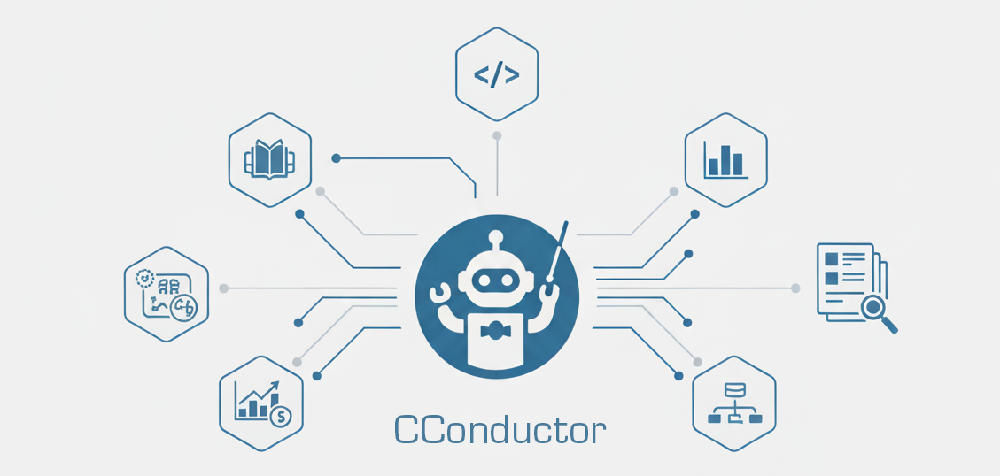
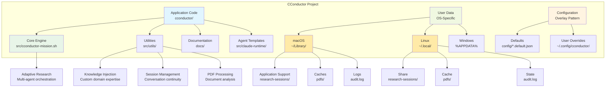

# CConductor 🔍

**AI Research, Orchestrated**

CConductor is a multi-agent AI research system that conducts comprehensive, adaptive research on any topic. Powered by Claude and specialized AI agents, it finds, analyzes, and synthesizes information from academic papers, web sources, PDFs, and code repositories—delivering well-cited, validated research reports.

---

## Why CConductor?

- 🧠 **Multi-Agent Intelligence** - Specialized agents for planning, research, synthesis, and validation work together
- 📚 **Multi-Source Research** - Handles academic papers, web content, PDFs, code, and market data
- ✅ **Built-In Validation** - Automatic fact-checking, citation tracking, and quality assessment
- 🎯 **Adaptive Research** - Identifies gaps, explores leads, and improves iteratively until high confidence
- 📊 **Quality Scores** - Know exactly how reliable your research is (0-100 with detailed breakdown)
- 🔒 **Configurable Security** - Control which domains to trust with flexible security profiles
- 🌍 **Cross-Platform** - Works on macOS, Linux, and Windows (WSL2)

---

## Quick Start

**Interactive Mode** (easiest):

```bash
./cconductor
# Launches dialog-based TUI for guided research setup
# (Install the optional `dialog` package for the full menu experience:
#   macOS → brew install dialog, Debian/Ubuntu → sudo apt install dialog)
```

**Direct Command**:

```bash
./cconductor "What is quantum computing?"
```

On first run, CConductor will automatically set up directories and configuration (takes ~5 seconds).

Your research report will be in `research-sessions/` with full citations and quality assessment.

**Choose mission type** (optional):

```bash
./cconductor "your question" --mission market-research       # Market analysis
./cconductor "your question" --mission academic-research     # Scholarly sources
./cconductor "your question" --mission competitive-analysis  # Competitor research
./cconductor "your question" --mission technical-analysis    # Technical deep-dive
# Default: general-research (flexible for any topic)
```

**View your results**:

```bash
./cconductor sessions latest
```

---

## What You Can Do

### Academic Research

Comprehensive research with full citations and bibliography.

```bash
./cconductor "Latest advances in CRISPR gene editing 2023-2024"
```

### Complex Research from Files

For multi-part research queries with structured context, use a markdown file:

```bash
./cconductor --question-file research-query.md
```

**Benefits:**
- Structured queries with background, sub-questions, and keywords
- Reusable research templates
- Version control for your research questions
- No command-line escaping issues

**Example file:**
```markdown
# Research Query: AI Safety Mechanisms

## Background
Need to understand current state of AI alignment research...

## Core Questions
1. What are the main approaches to AI alignment?
2. Which approaches show most promise?
3. What are the open challenges?

## Keywords
- AI alignment, RLHF, Constitutional AI...
```

### Research with Local Files

Analyze your own PDFs, documents, and notes alongside web research.

```bash
# Analyze pitch decks
./cconductor "Evaluate this pitch deck" --input-dir ./pitch-materials/

# Research with context documents
./cconductor "Summarize findings" --input-dir ~/Documents/research-reports/
```

**Supported formats:**

- PDFs (`.pdf`) - Automatically cached and analyzed
- Markdown (`.md`) - Loaded into session context
- Text files (`.txt`) - Loaded into session context

### Market Analysis

Business intelligence with market data and competitive insights.

```bash
./cconductor "SaaS CRM market size and growth 2024"
```

### Technical Deep-Dives

Detailed technical research with architecture and examples.

```bash
./cconductor "How does Docker containerization work?"
```

### General Research

Balanced research on any topic.

```bash
./cconductor "What causes climate change?"
```

---

## Features

### Core Capabilities

- **Adaptive Intelligence** - Dynamic knowledge graph tracks findings and identifies gaps
- **Multi-Agent System** - 10+ specialized agents for different research domains
- **PDF Research** - Automatic PDF caching and full-text analysis
- **Academic Databases** - Direct integration with arXiv, Semantic Scholar, PubMed
- **Parallel Execution** - Multiple research tasks run simultaneously
- **Citations & Bibliography** - Automatic source tracking and reference generation
- **Quality Assessment** - Every session receives a comprehensive quality score
- **Complete Audit Trail** - Every source and decision is logged

### Key Features

- ✨ **Citations & Bibliography** - Automatic source tracking and reference generation
- 📺 **Real-Time Dashboard** - Live research journal viewer showing progress, entities, claims, and agent activities (auto-launches)
- 📝 **Journal Export** - Export comprehensive markdown timeline of your research with all findings and metadata
- 📁 **Local File Analysis** - Analyze your own PDFs, markdown, and text files with `--input-dir`
- 🔒 **Configurable Security** - Three profiles (strict/permissive/max_automation)
- 📊 **Quality Validation** - Hard gating on every mission with automatic remediation passes; failures produce diagnostics in `artifacts/quality-gate.json` before prompting for any remaining manual fixes
- ♻️ **Web Fetch Cache** - Successful WebFetch calls are cached and surfaced to agents; reuse cached files via `Read` and append `?fresh=1` when a live refresh is required
- ♻️ **Web Search Cache** - WebSearch queries store snippets in the shared cache; check `Cached Sources Available` or run `bash library-memory/show-search.sh --query "<terms>"` before launching a new search.
- 🧰 **Cache Controls** - Run once with `--no-cache` (or selectively `--no-web-fetch-cache`, `--no-web-search-cache`) when you need live results without touching the caches.
- 🌍 **Cross-Platform Support** - Works on Windows, macOS, and Linux
- 📖 **Extensible Knowledge** - Add your own domain expertise without modifying code
- 🔍 **Progress Tracking** - See what's happening during research
- 💬 **Better Error Messages** - Clear explanations and recovery steps
- 🧮 **Safe Calculations** - Accurate math using bc (arbitrary precision calculator), not LLM estimation

---

### Quality Gate Enforcement

Every mission finishes with an automated quality gate that reviews each claim for:

- **Evidence coverage** – minimum sources and independent domains
- **Source trust** – weighted credibility (peer-reviewed, official, etc.)
- **Confidence and recency** – claim confidence and time-bound evidence

The gate now defaults to **advisory mode**:

- Reports still complete, but the top of the document shows a “Quality Issues Detected” banner when thresholds are missed.
- Sessions end with status `completed_with_advisory`, and the full diagnostics live in `artifacts/quality-gate.json` plus a compact summary in `artifacts/quality-gate-summary.json`.
- The orchestrator (or a manual resume) can read those files to follow the remediation checklist and rerun the gate.
- User-facing deliverables live in `report/` (mission report, research journal); supporting diagnostics remain in `artifacts/`.

Switch the config to `mode: "enforce"` if you prefer to block finalization until every threshold is satisfied. All thresholds and mode settings live in `~/.config/cconductor/quality-gate.json`.

---

## Requirements

- **Claude Code CLI** (required - CConductor is a Claude Code extension)
  - **Option 1: Native Installer** (Recommended, no Node.js needed):
    ```bash
    curl -fsSL https://claude.ai/install.sh | bash
    ```
  - **Option 2: npm** (if you prefer or already have Node.js):
    - Requires Node.js 18+: `brew install node` (macOS) or see [nodejs.org](https://nodejs.org/)
    - Install: `npm install -g @anthropic-ai/claude-code`
  - CConductor uses the Claude Code CLI in headless mode to invoke
    specialized agents with allowed tools (e.g., Bash, Read, WebSearch, MCP)
  - Cannot run standalone with just an API key
  - Available through Claude Pro/Max subscriptions or API/pay-as-you-go
  - See [Understanding Claude Code Access](#understanding-claude-code-access) below for details
- **Python 3** - For knowledge graph operations (usually pre-installed)
  - macOS: `brew install python3` (if needed)
  - Linux: Usually pre-installed; if not: `sudo apt-get install python3`
  - Windows (WSL): `sudo apt-get install python3`
- **Standard Unix tools**
  - **Bash shell** (4.0+)
  - **jq** (JSON processor)
  - **curl** (for web requests)
  - **bc** (arbitrary-precision calculator for accurate math)
    - macOS: Usually pre-installed; if not: `brew install bc`
    - Linux: `sudo apt install bc` or `sudo yum install bc`
    - Windows: Use WSL2, then `sudo apt install bc`
  - **ripgrep** (recommended for Search tool) - `brew install ripgrep` (macOS)

### Platform Compatibility

CConductor is tested and supported on:
- **macOS** 10.15+ (Catalina and later)
- **Linux** with GNU coreutils (Ubuntu 20.04+, Debian 10+, Fedora 33+)
- **Windows** via WSL2 (Windows Subsystem for Linux)

**Known Limitations**:
- **FreeBSD/OpenBSD**: `date` command format differs, may cause timestamp issues
- **Windows native**: Not supported - use WSL2

**Date/Time Dependencies**: All timestamp generation uses `date -u +"%Y-%m-%dT%H:%M:%SZ"` which works on macOS (BSD date) and Linux (GNU date). For other BSD variants, timestamps may need adjustment.

### Installing Dependencies

**macOS**:

```bash
# 0. Install Homebrew (if not already installed)
# Check if you have Homebrew:
brew --version

# If not installed, install Homebrew:
/bin/bash -c "$(curl -fsSL https://raw.githubusercontent.com/Homebrew/install/HEAD/install.sh)"

# 1. Install Claude Code CLI (Native Installer - Recommended)
curl -fsSL https://claude.ai/install.sh | bash

# OR if you prefer npm:
# brew install node
# npm install -g @anthropic-ai/claude-code

# 2. Login to Claude Code (REQUIRED)
claude login
# This opens a browser to authenticate with Claude.ai
# You need a Claude Pro/Max subscription or API credits

# 3. Install other dependencies
brew install bash jq curl bc ripgrep
# Note: macOS ships with Bash 3.2, but CConductor requires Bash 4.0+
# The brew-installed bash (5.x) will be at /opt/homebrew/bin/bash
# ripgrep is recommended for Search tool functionality

# 4. Verify installations
claude --version  # Should show claude-code version
rg --version      # Should show ripgrep version
claude whoami     # Should show your authenticated account
/opt/homebrew/bin/bash --version  # Should be 5.x or higher
```

**Linux** (Ubuntu/Debian):

```bash
# 1. Install Claude Code CLI (Native Installer - Recommended)
curl -fsSL https://claude.ai/install.sh | bash

# OR if you prefer npm:
# curl -fsSL https://deb.nodesource.com/setup_20.x | sudo -E bash -
# sudo apt-get install -y nodejs
# npm install -g @anthropic-ai/claude-code

# 2. Login to Claude Code
claude login

# 3. Install other dependencies
sudo apt-get install jq curl bash bc ripgrep
```

**Windows** (WSL):

```bash
# 1. Install Claude Code CLI (Native Installer - Recommended)
curl -fsSL https://claude.ai/install.sh | bash

# OR if you prefer npm:
# curl -fsSL https://deb.nodesource.com/setup_20.x | sudo -E bash -
# sudo apt-get install -y nodejs
# npm install -g @anthropic-ai/claude-code

# 2. Login to Claude Code
claude login

# 3. Install other dependencies
sudo apt-get install jq curl bash bc ripgrep
```

---

## Installation

### Quick Install (Recommended)

One command to install and set up everything:

```bash
curl -fsSL https://github.com/yaniv-golan/cconductor/releases/latest/download/install.sh | bash
```

This will:

- Download the latest stable release
- Verify checksums automatically  
- Install to `~/.cconductor`
- Run first-time setup automatically
- Optionally add to your PATH

Then use from anywhere:

```bash
cconductor "your research question"
```

### Homebrew (macOS)

```bash
# Add tap
brew tap yaniv-golan/cconductor

# Install CConductor
brew install cconductor

# Install Claude Code CLI (required)
npm install -g @anthropic-ai/claude-code

# Set up authentication - create config file:
mkdir -p ~/.config/claude
cat > ~/.config/claude/config.json << 'EOF'
{
  "api_key": "your_anthropic_api_key_here"
}
EOF

# Start researching
cconductor "What is quantum computing?"
```

### Docker

**Quick Start (with existing Claude credentials)**:

```bash
docker run -v ~/.claude:/root/.claude \
  -v ~/research:/data/research-sessions \
  ghcr.io/yaniv-golan/cconductor:latest \
  "What is quantum computing?"
```

**Using API Key** (for CI/CD):

```bash
# Create .env file
echo "ANTHROPIC_API_KEY=sk-ant-xxx" > .env

# Run with env file
docker run --env-file .env \
  -v ~/research:/data/research-sessions \
  ghcr.io/yaniv-golan/cconductor:latest \
  "What is quantum computing?"
```

**Production (Docker Swarm)**:

```bash
# Create secret
echo "sk-ant-xxx" | docker secret create anthropic_api_key -

# Deploy service
docker service create \
  --secret anthropic_api_key \
  --mount type=volume,source=research-data,target=/data \
  ghcr.io/yaniv-golan/cconductor:latest
```

See [Docker Documentation](docs/DOCKER.md) for complete details.

### Verified Install (High Security)

For production or security-sensitive environments:

```bash
# Download installer and checksum
curl -LO https://github.com/yaniv-golan/cconductor/releases/latest/download/install.sh
curl -LO https://github.com/yaniv-golan/cconductor/releases/latest/download/install.sh.sha256

# Verify integrity
sha256sum -c install.sh.sha256

# Install
bash install.sh
```

### Specific Version

```bash
export CCONDUCTOR_VERSION=v0.3.1
curl -fsSL https://github.com/yaniv-golan/cconductor/releases/download/v0.3.1/install.sh | bash
```

### Manual Install (Development)

```bash
# Clone the repository
git clone https://github.com/yaniv-golan/cconductor.git
cd cconductor

# Start researching!
chmod +x cconductor
./cconductor "your research question"
```

**Note:** If you get "Permission denied", run: `chmod +x cconductor`

Setup happens automatically on first run.

## Updates

CConductor automatically checks for updates once per day.

**Update manually:**

```bash
cconductor --update
```

**Check for updates:**

```bash
cconductor --check-update
```

**Disable update checks:**

```bash
# Temporarily
cconductor --no-update-check "your question"

# Permanently - edit ~/.config/cconductor/cconductor-config.json:
{
  "update_settings": {
    "check_for_updates": false
  }
}
```

---

## Understanding Claude Code Access

CConductor requires Claude Code to function and cannot run with just an Anthropic API key.

### What is Claude Code?

Claude Code allows Claude to run integrated developer workflows from your terminal/IDE. CConductor uses the Claude Code CLI in headless mode with allowed tools to orchestrate its multi-agent research system.

### Getting Access

Claude Code is available through:

- **Claude Pro/Max subscriptions** - Includes Claude Code usage within your plan quota
- **API/Pay-as-you-go** - Billed separately per usage when you exceed plan limits

### Understanding Costs

- Your Claude subscription (Pro, Max) includes a quota of Claude Code usage
- Usage beyond your quota falls back to API billing (pay-per-use)
- API and subscription billing are separate systems
- Research sessions typically use multiple prompts (planning, research, synthesis, validation)

### Which Plan Do I Need?

- **Pro Plan** - Suitable for occasional research sessions
- **Max Plan** - Better for frequent or intensive research
- **API Credits** - Available for usage beyond plan limits

**For current pricing and plan details**, see:

- [Anthropic Pricing](https://www.anthropic.com/pricing)
- [Using Claude Code with Plans](https://support.anthropic.com/en/articles/11145838-using-claude-code-with-your-pro-or-max-plan)
- [API Usage Billing](https://support.anthropic.com/en/articles/8977456-how-do-i-pay-for-my-api-usage)

**Note**: Plan features, quotas, and pricing are subject to change. Always verify current details with Anthropic.

---

### Advanced Options

**Custom install location:**

```bash
curl -fsSL https://raw.githubusercontent.com/yaniv-golan/cconductor/main/install.sh | bash -s /custom/path
```

**Manual initialization:**

```bash
./cconductor --init              # Interactive mode
./cconductor --init --yes        # Non-interactive (for scripts)
```

---

## Usage

### Basic Commands

```bash
# Start new research (auto-launches real-time dashboard)
./cconductor "your research question"

# View latest results
./cconductor sessions latest

# View research dashboard (auto-launched during research)
./cconductor view-dashboard              # Latest session
./cconductor view-dashboard mission_123  # Specific session

# Export research journal as markdown
SESSION_DIR=$(./src/utils/path-resolver.sh resolve session_dir)
bash src/utils/export-journal.sh "$SESSION_DIR/$(cat "$SESSION_DIR/.latest")"

# List all sessions
./cconductor sessions

# Continue previous research
./cconductor resume mission_1759420487

# Check if research is running
./cconductor status

# View configuration
./cconductor configure

# Run/re-run initialization
./cconductor --init

# Show help
./cconductor --help

# Show version
./cconductor --version
```

### Session Outputs & Storage

Every mission writes to a timestamped directory under `research-sessions/mission_<id>/` with an organized session tree (v0.4.0):

- `INDEX.json` – Session manifest with file counts, checksums, and quick navigation
- `README.md` – "start here" session map with quick links and stats
- `meta/` – Session metadata, provenance, budgeting, and orchestrator state
- `inputs/` – Original research question and user-provided files
- `cache/` – Web/search cache artifacts reused within the mission
- `work/` – Agent working directories and intermediate findings
- `knowledge/` – Knowledge graph and session knowledge files
- `artifacts/` – Agent-produced artifacts with manifest
- `evidence/` – Footnotes, bibliographies, and quality gate exports wired into the final report
- `library/` – Mission-scoped Library Memory digests for reuse across missions
- `logs/` – Events, orchestration decisions, quality gate diagnostics, system errors
- `report/` – Final mission report and research journal
- `viewer/` – Interactive dashboard (HTML/JS)

**Key Files**:
- `report/mission-report.md` – User-facing research report
- `report/research-journal.md` – Chronological mission journal
- `knowledge/knowledge-graph.json` – Structured knowledge state
- `viewer/index.html` – Real-time research dashboard

Two additional storage locations matter for reuse:

- **Platform cache** – transient WebFetch/WebSearch assets stored under the OS cache root (`~/Library/Caches/CConductor/` on macOS, `${XDG_CACHE_HOME:-~/.cache}/cconductor/` on Linux). Clearing it only forces fresh network calls next time.
- **Library** – durable digests in the repository's `library/` directory (or `LIBRARY_MEMORY_ROOT`). Populated by `src/utils/digital-librarian.sh` from knowledge-graph citations and reused through the LibraryMemory skill.

### Built-in Skills

- **Cache-Aware Web Research** — shared guidance for canonical query reuse, LibraryMemory digests, and deciding when to bypass caches with `?fresh=1`. Copied into each session’s `.claude/skills/` directory.
- **LibraryMemory** — hash, digest, and cached search helpers for reusing previously collected evidence (also copied into `.claude/skills/`).

### Examples

```bash
# Research any topic
./cconductor "What is quantum computing?"

# Academic question
./cconductor "Latest research on mRNA vaccines"

# Business question
./cconductor "AI coding assistant market landscape"

# Technical question
./cconductor "Kubernetes architecture and components"

# Resume to improve quality
./cconductor resume mission_1759420487
```

---

## Research Modes

CConductor automatically selects the best approach based on your question, or you can configure the default mode in `~/.config/cconductor/cconductor-config.json`.

**Available modes** (defaults in `config/cconductor-modes.default.json`, customize in `~/.config/cconductor/cconductor-modes.json`):

- **default** - Balanced research for general topics
- **scientific** - Academic research with peer-reviewed sources
- **market** - Business and competitive analysis
- **technical** - Technical and architectural deep-dives  
- **literature_review** - Comprehensive academic literature reviews

**Mode selection**: Automatic detection based on your question keywords.

**Coming in future releases**: Additional mode selection options and configuration. See [User Guide](docs/USER_GUIDE.md) for complete feature status.

---

## Example Output

After running research, CConductor generates comprehensive reports:

```markdown
# Research Report

Generated by: CConductor - Deep Research, Done Right
Date: October 2, 2025
Session: session_1759420487

━━━━━━━━━━━━━━━━━━━━━━━━━━━━━━━━━━━━━━━━━━━━━━━

🔍 Research Question: What is quantum computing?
📊 Quality Score: 87/100 - EXCELLENT
📚 Sources: 42 (18 academic, 16 web, 8 PDF)
⏱️  Duration: 18 minutes

━━━━━━━━━━━━━━━━━━━━━━━━━━━━━━━━━━━━━━━━━━━━━━━

## Executive Summary

Quantum computing is a revolutionary computing paradigm that leverages
quantum mechanical phenomena—superposition and entanglement—to process
information [1]. Unlike classical computers that use bits (0 or 1),
quantum computers use quantum bits or qubits that can exist in multiple
states simultaneously [2]...

## Bibliography

[1] Nielsen, M. & Chuang, I. (2010). Quantum Computation and Quantum
    Information. Cambridge University Press.
[2] IBM Research. (2024). "What is Quantum Computing?" Retrieved from
    https://research.ibm.com/quantum-computing
...
```

---

## Configuration

CConductor is highly configurable without code changes.

### Security Profiles

Control which domains CConductor can access:

**Location**: `~/.config/cconductor/security-config.json` (create with `./src/utils/config-loader.sh init security-config`)

**Default configuration** (`config/security-config.default.json`):
```json
{
  "security_profile": "strict"
}
```

**Available profiles**:
```json
{
  "security_profile": "strict"       // Maximum safety (default)
  // OR
  "security_profile": "permissive"   // Balanced approach
  // OR
  "security_profile": "max_automation" // Testing only (use in VMs)
}
```

**Profiles**:

- **strict** - Academic/sensitive data, prompts for unknown domains
- **permissive** - Business research, fewer prompts, trusted networks
- **max_automation** - Testing/sandboxed only, minimal prompts

See [Security Guide](docs/SECURITY_GUIDE.md) for details.

### Custom Knowledge

Teach CConductor about your domain:

**Location**:

- macOS: `~/Library/Application Support/CConductor/knowledge-base-custom/my-domain.md`
- Linux: `~/.local/share/cconductor/knowledge-base-custom/my-domain.md`

**Note**: Capitalization follows platform conventions: macOS uses `CConductor` (Title Case) while Linux/Windows use `cconductor` (lowercase).

```markdown
## Overview
What this knowledge covers.

## Key Concepts
- Term 1: Definition
- Term 2: Definition

## Important Facts
- Fact about your domain
```

CConductor automatically discovers and uses all `.md` files in your custom knowledge directory!

**Tip**: Use `./src/utils/path-resolver.sh resolve knowledge_base_custom` to find your exact path.

See [Custom Knowledge Guide](docs/CUSTOM_KNOWLEDGE.md) for details.

### Research Preferences

**Location**: `~/.config/cconductor/cconductor-config.json` (create with `./src/utils/config-loader.sh init cconductor-config`)

Configure default behavior, agent settings, output preferences, and quality standards.

See [Configuration Reference](docs/CONFIGURATION_REFERENCE.md) for all options.

---

## Documentation

📖 **Start here**:

- **[User Guide](docs/USER_GUIDE.md)** - Comprehensive guide for all features
- **[Quick Reference](docs/QUICK_REFERENCE.md)** - Command cheat sheet

🎯 **Feature guides**:

- **[Citations & Bibliography](docs/CITATIONS_GUIDE.md)** - Using citations effectively
- **[Security Configuration](docs/SECURITY_GUIDE.md)** - Security profiles explained
- **[Quality Scores](docs/QUALITY_GUIDE.md)** - Understanding and improving quality
- **[Custom Knowledge](docs/CUSTOM_KNOWLEDGE.md)** - Adding domain expertise
- **[PDF Research](docs/PDF_RESEARCH_GUIDE.md)** - Working with academic papers

🔧 **Reference**:

- **[Configuration Reference](docs/CONFIGURATION_REFERENCE.md)** - All config files
- **[Troubleshooting](docs/TROUBLESHOOTING.md)** - Fix common problems

---

## Architecture

CConductor uses a multi-agent architecture with specialized agents:

- **Research Planner** - Understands questions and creates research plans
- **Web Researcher** - Searches and analyzes web sources
- **Academic Researcher** - Finds and analyzes academic papers
- **PDF Analyzer** - Extracts insights from PDF documents
- **Market Analyzer** - Business and market intelligence
- **Code Analyzer** - Technical and architectural analysis
- **Synthesis Agent** - Combines findings into coherent reports
- **Fact Checker** - Validates claims and detects contradictions

Research uses an **Adaptive System** that dynamically iterates with gap detection, contradiction resolution, and lead exploration until high confidence is achieved.

---

## Project Structure

### Visual Project Architecture



### Detailed Directory Structure

#### Application Code (Git-Tracked)

```
cconductor/
├── cconductor                      # Main CLI entry point
├── src/
│   ├── cconductor-mission.sh      # Mission-based research engine
│   ├── knowledge-graph.sh         # Knowledge state tracking
│   ├── task-queue.sh             # Dynamic task management
│   ├── shared-state.sh           # Concurrent access control
│   ├── utils/                    # Utility scripts (17 files)
│   │   ├── knowledge-loader.sh   # Custom knowledge injection
│   │   ├── invoke-agent.sh       # Agent invocation
│   │   └── config-loader.sh      # Configuration management
├── config/
│   ├── *.default.json           # Default configs (never edit)
│   └── README.md                # Configuration documentation
├── docs/                        # Documentation (this file!)
├── knowledge-base/              # Built-in domain knowledge
└── src/claude-runtime/          # Claude Code agent templates
```

#### User Data (OS-Appropriate, Git-Ignored)

**macOS**:
```
~/Library/Application Support/CConductor/
├── research-sessions/          # Your research output
├── knowledge-base-custom/      # Your custom knowledge files
└── citations.json             # Citation database

~/Library/Caches/CConductor/     # PDF cache and temp files
└── pdfs/                      # Downloaded and processed PDFs

~/Library/Logs/CConductor/      # System logs
└── audit.log                  # Security and usage audit log
```

**Linux** (XDG Base Directory):
```
~/.local/share/cconductor/      # Your research data
├── research-sessions/         # Research session outputs
├── knowledge-base-custom/     # Custom knowledge files
└── citations.json            # Citation tracking

~/.cache/cconductor/           # Cache directory
└── pdfs/                     # PDF processing cache

~/.local/state/cconductor/     # State and logs
└── audit.log                 # Audit trail
```

**Windows**:
```
%LOCALAPPDATA%\CConductor\     # User data directory
├── research-sessions/        # Research outputs
├── knowledge-base-custom/    # Custom knowledge
└── citations.json           # Citations

%TEMP%\CConductor\            # Temporary files
└── cache\                   # PDF and processing cache
```

**Directory Structure Benefits**:

- **Separation of Concerns**: Code, data, and configuration are clearly separated
- **Cross-Platform**: Works on macOS, Linux, and Windows with appropriate paths
- **User Isolation**: Each user has their own data and configurations
- **Upgrade Safety**: User data survives project reinstallation
- **Git-Friendly**: Only application code is tracked, user data is ignored

---

### What's Working

- ✅ Mission-based orchestration with autonomous agent coordination
- ✅ Multi-agent research system with specialized agents
- ✅ Knowledge graph integration (production-ready)
- ✅ Interactive research wizard and verbose progress mode
- ✅ Citation tracking and bibliography
- ✅ Security configuration system
- ✅ Quality validation gates
- ✅ Custom knowledge base
- ✅ Cross-platform support
- ✅ Comprehensive documentation

### Roadmap

- 🚧 Mission resume/refinement capabilities
- 🚧 Enhanced PDF extraction
- 🚧 Multi-language support
- 🚧 Progress indicators
- 🚧 Enhanced session management

See [CHANGELOG.md](CHANGELOG.md) for version history.

---

## Contributing

Contributions are welcome! See [CONTRIBUTING.md](CONTRIBUTING.md) for guidelines.

For technical documentation:

- [Knowledge System Technical Deep Dive](docs/KNOWLEDGE_SYSTEM_TECHNICAL.md) - Complete architecture and debugging
- [Implementation Status](docs/technical/IMPLEMENTATION_STATUS.md)
- [Agent Migration Guide](docs/technical/AGENT_MIGRATION_GUIDE.md)
- [Adaptive Research Plan](docs/technical/ADAPTIVE_RESEARCH_PLAN.md)

---

## License

MIT License - See [LICENSE](LICENSE) file for details

---

## Support

- **Documentation**: [docs/](docs/)
- **Issues**: [GitHub Issues](https://github.com/yaniv-golan/cconductor/issues)
- **Discussions**: [GitHub Discussions](https://github.com/yaniv-golan/cconductor/discussions)

---

## Acknowledgments

Built with:

- [Claude](https://anthropic.com/claude) by Anthropic
- [jq](https://stedolan.github.io/jq/) for JSON processing
- bash for reliable scripting

---

**CConductor** - AI Research, Orchestrated 🔍
