# CConductor 🔍

**AI Research, Orchestrated**

CConductor is a multi-agent AI research system that conducts comprehensive, adaptive research on any topic. Powered by Claude and specialized AI agents, it finds, analyzes, and synthesizes information from academic papers, web sources, PDFs, and code repositories—delivering well-cited, validated research reports.

---

## Why CConductor?

- 🧠 **Multi-Agent Intelligence** - Specialized agents for planning, research, synthesis, and validation work together
- 📚 **Multi-Source Research** - Handles academic papers, web content, PDFs, code, and market data
- ✅ **Built-In Validation** - Automatic fact-checking, citation tracking, and quality assessment
- 🎯 **Adaptive Research** - Identifies gaps, explores leads, and improves iteratively until high confidence
- 📊 **Quality Scores** - Know exactly how reliable your research is (0-100 with detailed breakdown)
- 🔒 **Configurable Security** - Control which domains to trust with flexible security profiles
- 🌍 **Cross-Platform** - Works on macOS, Linux, and Windows (WSL/Git Bash)

---

## Quick Start

Get up and running in 1 command:

```bash
./cconductor "What is quantum computing?"
```

On first run, CConductor will automatically set up directories and configuration (takes ~5 seconds).

Your research report will be in `research-sessions/` with full citations and quality assessment.

**View your results**:

```bash
./cconductor latest
```

---

## What You Can Do

### Academic Research

Comprehensive research with full citations and bibliography.

```bash
./cconductor "Latest advances in CRISPR gene editing 2023-2024"
```

### Complex Research from Files

For multi-part research queries with structured context, use a markdown file:

```bash
./cconductor --question-file research-query.md
```

**Benefits:**
- Structured queries with background, sub-questions, and keywords
- Reusable research templates
- Version control for your research questions
- No command-line escaping issues

**Example file:**
```markdown
# Research Query: AI Safety Mechanisms

## Background
Need to understand current state of AI alignment research...

## Core Questions
1. What are the main approaches to AI alignment?
2. Which approaches show most promise?
3. What are the open challenges?

## Keywords
- AI alignment, RLHF, Constitutional AI...
```

### Research with Local Files

Analyze your own PDFs, documents, and notes alongside web research.

```bash
# Analyze pitch decks
./cconductor "Evaluate this pitch deck" --input-dir ./pitch-materials/

# Research with context documents
./cconductor "Summarize findings" --input-dir ~/Documents/research-reports/
```

**Supported formats:**

- PDFs (`.pdf`) - Automatically cached and analyzed
- Markdown (`.md`) - Loaded into session context
- Text files (`.txt`) - Loaded into session context

### Market Analysis

Business intelligence with market data and competitive insights.

```bash
./cconductor "SaaS CRM market size and growth 2024"
```

### Technical Deep-Dives

Detailed technical research with architecture and examples.

```bash
./cconductor "How does Docker containerization work?"
```

### General Research

Balanced research on any topic.

```bash
./cconductor "What causes climate change?"
```

---

## Features

### Core Capabilities

- **Adaptive Intelligence** - Dynamic knowledge graph tracks findings and identifies gaps
- **Multi-Agent System** - 10+ specialized agents for different research domains
- **PDF Research** - Automatic PDF caching and full-text analysis
- **Academic Databases** - Direct integration with arXiv, Semantic Scholar, PubMed
- **Parallel Execution** - Multiple research tasks run simultaneously
- **Citations & Bibliography** - Automatic source tracking and reference generation
- **Quality Assessment** - Every session receives a comprehensive quality score
- **Complete Audit Trail** - Every source and decision is logged

### v0.1.0 Features

- ✨ **Citations & Bibliography** - Automatic source tracking and reference generation
- 📺 **Real-Time Dashboard** - Live research journal viewer showing progress, entities, claims, and agent activities (auto-launches)
- 📝 **Journal Export** - Export comprehensive markdown timeline of your research with all findings and metadata
- 📁 **Local File Analysis** - Analyze your own PDFs, markdown, and text files with `--input-dir`
- 🔒 **Configurable Security** - Three profiles (strict/permissive/max_automation)
- 📊 **Quality Validation** - Research quality gates prevent incomplete results
- 🌍 **Cross-Platform Support** - Works on Windows, macOS, and Linux
- 📖 **Extensible Knowledge** - Add your own domain expertise without modifying code
- 🔍 **Progress Tracking** - See what's happening during research
- 💬 **Better Error Messages** - Clear explanations and recovery steps
- 🧮 **Safe Calculations** - Accurate math using bc (arbitrary precision calculator), not LLM estimation

---

## Requirements

- **Node.js** (18+) - Required to install Claude Code CLI
  - npm comes bundled with Node.js
  - Install: `brew install node` (macOS) or see [nodejs.org](https://nodejs.org/)
- **Claude Code CLI** (required - CConductor is a Claude Code extension)
  - Install: `npm install -g @anthropic-ai/claude-code`
  - CConductor uses the Claude Code CLI in headless mode to invoke
    specialized agents with allowed tools (e.g., Bash, Read, WebSearch,
    MCP)
  - Cannot run standalone with just an API key
  - Available through Claude Pro/Max subscriptions or API/pay-as-you-go
  - See [Understanding Claude Code Access](#understanding-claude-code-access) below for details
- **Bash shell** (4.0+)
- **jq** (JSON processor)
- **curl** (for web requests)
- **bc** (for calculations, pre-installed on most systems)

### Installing Dependencies

**macOS**:

```bash
# 0. Install Homebrew (if not already installed)
# Check if you have Homebrew:
brew --version

# If not installed, install Homebrew:
/bin/bash -c "$(curl -fsSL https://raw.githubusercontent.com/Homebrew/install/HEAD/install.sh)"

# 1. Install Node.js (includes npm)
brew install node

# 2. Install Claude Code CLI
npm install -g @anthropic-ai/claude-code

# 3. Login to Claude Code (REQUIRED)
claude login
# This opens a browser to authenticate with Claude.ai
# You need a Claude Pro/Max subscription or API credits

# 4. Install other dependencies
brew install bash jq curl bc
# Note: macOS ships with Bash 3.2, but CConductor requires Bash 4.0+
# The brew-installed bash (5.x) will be at /opt/homebrew/bin/bash

# 5. Verify installations
node --version    # Should be v18 or higher
claude --version  # Should show claude-code version
claude whoami     # Should show your authenticated account
/opt/homebrew/bin/bash --version  # Should be 5.x or higher
```

**Linux** (Ubuntu/Debian):

```bash
# 1. Install Node.js (includes npm)
curl -fsSL https://deb.nodesource.com/setup_20.x | sudo -E bash -
sudo apt-get install -y nodejs

# 2. Install Claude Code CLI
npm install -g @anthropic-ai/claude-code

# 3. Install other dependencies
sudo apt-get install jq curl bash bc
```

**Windows** (WSL):

```bash
# 1. Install Node.js
curl -fsSL https://deb.nodesource.com/setup_20.x | sudo -E bash -
sudo apt-get install -y nodejs

# 2. Install Claude Code CLI
npm install -g @anthropic-ai/claude-code

# 3. Install other dependencies
sudo apt-get install jq curl bash bc
```

---

## Installation

### Quick Install (Recommended)

One command to install and set up everything:

```bash
curl -fsSL https://github.com/yaniv-golan/cconductor/releases/latest/download/install.sh | bash
```

This will:

- Download the latest stable release
- Verify checksums automatically  
- Install to `~/.cconductor`
- Run first-time setup automatically
- Optionally add to your PATH

Then use from anywhere:

```bash
cconductor "your research question"
```

### Verified Install (High Security)

For production or security-sensitive environments:

```bash
# Download installer and checksum
curl -LO https://github.com/yaniv-golan/cconductor/releases/latest/download/install.sh
curl -LO https://github.com/yaniv-golan/cconductor/releases/latest/download/install.sh.sha256

# Verify integrity
sha256sum -c install.sh.sha256

# Install
bash install.sh
```

### Specific Version

```bash
export CCONDUCTOR_VERSION=v0.1.0
curl -fsSL https://github.com/yaniv-golan/cconductor/releases/download/v0.1.0/install.sh | bash
```

### Manual Install (Development)

```bash
# Clone the repository
git clone https://github.com/yaniv-golan/cconductor.git
cd cconductor

# Start researching!
chmod +x cconductor
./cconductor "your research question"
```

**Note:** If you get "Permission denied", run: `chmod +x cconductor`

Setup happens automatically on first run.

## Updates

CConductor automatically checks for updates once per day.

**Update manually:**

```bash
cconductor --update
```

**Check for updates:**

```bash
cconductor --check-update
```

**Disable update checks:**

```bash
# Temporarily
cconductor --no-update-check "your question"

# Permanently - edit ~/.config/cconductor/cconductor-config.json:
{
  "update_settings": {
    "check_for_updates": false
  }
}
```

---

## Understanding Claude Code Access

CConductor requires Claude Code to function and cannot run with just an Anthropic API key.

### What is Claude Code?

Claude Code allows Claude to run integrated developer workflows from your terminal/IDE. CConductor uses the Claude Code CLI in headless mode with allowed tools to orchestrate its multi-agent research system.

### Getting Access

Claude Code is available through:

- **Claude Pro/Max subscriptions** - Includes Claude Code usage within your plan quota
- **API/Pay-as-you-go** - Billed separately per usage when you exceed plan limits

### Understanding Costs

- Your Claude subscription (Pro, Max) includes a quota of Claude Code usage
- Usage beyond your quota falls back to API billing (pay-per-use)
- API and subscription billing are separate systems
- Research sessions typically use multiple prompts (planning, research, synthesis, validation)

### Which Plan Do I Need?

- **Pro Plan** - Suitable for occasional research sessions
- **Max Plan** - Better for frequent or intensive research
- **API Credits** - Available for usage beyond plan limits

**For current pricing and plan details**, see:

- [Anthropic Pricing](https://www.anthropic.com/pricing)
- [Using Claude Code with Plans](https://support.anthropic.com/en/articles/11145838-using-claude-code-with-your-pro-or-max-plan)
- [API Usage Billing](https://support.anthropic.com/en/articles/8977456-how-do-i-pay-for-my-api-usage)

**Note**: Plan features, quotas, and pricing are subject to change. Always verify current details with Anthropic.

---

### Advanced Options

**Custom install location:**

```bash
curl -fsSL https://raw.githubusercontent.com/yaniv-golan/cconductor/main/install.sh | bash -s /custom/path
```

**Manual initialization:**

```bash
./cconductor --init              # Interactive mode
./cconductor --init --yes        # Non-interactive (for scripts)
```

---

## Usage

### Basic Commands

```bash
# Start new research (auto-launches real-time dashboard)
./cconductor "your research question"

# View latest results
./cconductor latest

# View research dashboard (auto-launched during research)
./cconductor view-dashboard              # Latest session
./cconductor view-dashboard session_123  # Specific session

# Export research journal as markdown
SESSION_DIR=$(./src/utils/path-resolver.sh resolve session_dir)
bash src/utils/export-journal.sh "$SESSION_DIR/$(cat "$SESSION_DIR/.latest")"

# List all sessions
./cconductor sessions

# Continue previous research
./cconductor resume session_1759420487

# Check if research is running
./cconductor status

# View configuration
./cconductor configure

# Run/re-run initialization
./cconductor --init

# Show help
./cconductor --help

# Show version
./cconductor --version
```

### Examples

```bash
# Research any topic
./cconductor "What is quantum computing?"

# Academic question
./cconductor "Latest research on mRNA vaccines"

# Business question
./cconductor "AI coding assistant market landscape"

# Technical question
./cconductor "Kubernetes architecture and components"

# Resume to improve quality
./cconductor resume session_1759420487
```

---

## Research Modes

CConductor automatically selects the best approach based on your question, or you can configure the default mode in `~/.config/cconductor/cconductor-config.json`.

**Available modes** (defaults in `config/cconductor-modes.default.json`, customize in `~/.config/cconductor/cconductor-modes.json`):

- **default** - Balanced research for general topics
- **scientific** - Academic research with peer-reviewed sources
- **market** - Business and competitive analysis
- **technical** - Technical and architectural deep-dives  
- **literature_review** - Comprehensive academic literature reviews

**Mode selection in v0.1**: Automatic detection based on your question keywords.

**Coming in v1.1**: Explicit mode selection via `--mode` CLI option and additional options (`--speed`, `--output`, `--iterations`, etc.). See [User Guide](docs/USER_GUIDE.md) "What's Coming" section for complete feature status and workarounds.

---

## Example Output

After running research, CConductor generates comprehensive reports:

```markdown
# Research Report

Generated by: CConductor v0.1.0 - Deep Research, Done Right
Date: October 2, 2025
Session: session_1759420487

━━━━━━━━━━━━━━━━━━━━━━━━━━━━━━━━━━━━━━━━━━━━━━━

🔍 Research Question: What is quantum computing?
📊 Quality Score: 87/100 - EXCELLENT
📚 Sources: 42 (18 academic, 16 web, 8 PDF)
⏱️  Duration: 18 minutes

━━━━━━━━━━━━━━━━━━━━━━━━━━━━━━━━━━━━━━━━━━━━━━━

## Executive Summary

Quantum computing is a revolutionary computing paradigm that leverages
quantum mechanical phenomena—superposition and entanglement—to process
information [1]. Unlike classical computers that use bits (0 or 1),
quantum computers use quantum bits or qubits that can exist in multiple
states simultaneously [2]...

## Bibliography

[1] Nielsen, M. & Chuang, I. (2010). Quantum Computation and Quantum
    Information. Cambridge University Press.
[2] IBM Research. (2024). "What is Quantum Computing?" Retrieved from
    https://research.ibm.com/quantum-computing
...
```

---

## Configuration

CConductor is highly configurable without code changes.

### Security Profiles

Control which domains CConductor can access:

**Location**: `~/.config/cconductor/security-config.json` (create with `./src/utils/config-loader.sh init security-config`)

```json
{
  "security_profile": "strict"       // Maximum safety (default)
  // OR
  "security_profile": "permissive"   // Balanced approach
  // OR
  "security_profile": "max_automation" // Testing only (use in VMs)
}
```

**Profiles**:

- **strict** - Academic/sensitive data, prompts for unknown domains
- **permissive** - Business research, fewer prompts, trusted networks
- **max_automation** - Testing/sandboxed only, minimal prompts

See [Security Guide](docs/SECURITY_GUIDE.md) for details.

### Custom Knowledge

Teach CConductor about your domain:

**Location**:

- macOS: `~/Library/Application Support/CConductor/knowledge-base-custom/my-domain.md`
- Linux: `~/.local/share/cconductor/knowledge-base-custom/my-domain.md`

```markdown
## Overview
What this knowledge covers.

## Key Concepts
- Term 1: Definition
- Term 2: Definition

## Important Facts
- Fact about your domain
```

CConductor automatically discovers and uses all `.md` files in your custom knowledge directory!

**Tip**: Use `./src/utils/path-resolver.sh resolve knowledge_base_custom` to find your exact path.

See [Custom Knowledge Guide](docs/CUSTOM_KNOWLEDGE.md) for details.

### Research Preferences

**Location**: `~/.config/cconductor/cconductor-config.json` (create with `./src/utils/config-loader.sh init cconductor-config`)

Configure default behavior, agent settings, output preferences, and quality standards.

See [Configuration Reference](docs/CONFIGURATION_REFERENCE.md) for all options.

---

## Documentation

📖 **Start here**:

- **[User Guide](docs/USER_GUIDE.md)** - Comprehensive guide for all features
- **[Quick Reference](docs/QUICK_REFERENCE.md)** - Command cheat sheet

🎯 **Feature guides**:

- **[Citations & Bibliography](docs/CITATIONS_GUIDE.md)** - Using citations effectively
- **[Security Configuration](docs/SECURITY_GUIDE.md)** - Security profiles explained
- **[Quality Scores](docs/QUALITY_GUIDE.md)** - Understanding and improving quality
- **[Custom Knowledge](docs/CUSTOM_KNOWLEDGE.md)** - Adding domain expertise
- **[PDF Research](docs/PDF_RESEARCH_GUIDE.md)** - Working with academic papers

🔧 **Reference**:

- **[Configuration Reference](docs/CONFIGURATION_REFERENCE.md)** - All config files
- **[Troubleshooting](docs/TROUBLESHOOTING.md)** - Fix common problems

---

## Architecture

CConductor uses a multi-agent architecture with specialized agents:

- **Research Planner** - Understands questions and creates research plans
- **Web Researcher** - Searches and analyzes web sources
- **Academic Researcher** - Finds and analyzes academic papers
- **PDF Analyzer** - Extracts insights from PDF documents
- **Market Analyzer** - Business and market intelligence
- **Code Analyzer** - Technical and architectural analysis
- **Synthesis Agent** - Combines findings into coherent reports
- **Fact Checker** - Validates claims and detects contradictions

Research uses an **Adaptive System** that dynamically iterates with gap detection, contradiction resolution, and lead exploration until high confidence is achieved.

---

## Project Structure

### Visual Project Architecture

```mermaid
graph TD
    subgraph "CConductor Project"
        A[Application Code<br/>cconductor/]
        B[User Data<br/>OS-Specific]
        C[Configuration<br/>Overlay Pattern]

        A --> D[Core Engine<br/>src/cconductor-adaptive.sh]
        A --> E[Utilities<br/>src/utils/]
        A --> F[Formatters<br/>src/formatters/]
        A --> G[Documentation<br/>docs/]
        A --> H[Agent Templates<br/>src/claude-runtime/]

        B --> I[macOS<br/>~/Library/]
        B --> J[Linux<br/>~/.local/]
        B --> K[Windows<br/>%APPDATA%]

        C --> L[Defaults<br/>config/*.default.json]
        C --> M[User Overrides<br/>~/.config/cconductor/]
    end

    D --> N[Adaptive Research<br/>Multi-agent orchestration]
    E --> O[Knowledge Injection<br/>Custom domain expertise]
    E --> P[Session Management<br/>Conversation continuity]
    E --> Q[PDF Processing<br/>Document analysis]
    F --> R[Output Formats<br/>Markdown, HTML, JSON]

    I --> S[Application Support<br/>research-sessions/]
    I --> T[Caches<br/>pdfs/]
    I --> U[Logs<br/>audit.log]

    J --> V[Share<br/>research-sessions/]
    J --> W[Cache<br/>pdfs/]
    J --> X[State<br/>audit.log]

    style A fill:#e1f5ff
    style B fill:#f0f8e1
    style C fill:#fff4e1
    style D fill:#e8f5e8
    style I fill:#ffeaa7
    style J fill:#ffeaa7
```



### Detailed Directory Structure

#### Application Code (Git-Tracked)

```
cconductor/
├── cconductor                      # Main CLI entry point
├── src/
│   ├── cconductor-adaptive.sh     # Adaptive research engine
│   ├── knowledge-graph.sh         # Knowledge state tracking
│   ├── task-queue.sh             # Dynamic task management
│   ├── shared-state.sh           # Concurrent access control
│   ├── utils/                    # Utility scripts (17 files)
│   │   ├── knowledge-loader.sh   # Custom knowledge injection
│   │   ├── invoke-agent.sh       # Agent invocation
│   │   └── config-loader.sh      # Configuration management
│   └── formatters/               # Output formatters (6 files)
├── config/
│   ├── *.default.json           # Default configs (never edit)
│   └── README.md                # Configuration documentation
├── docs/                        # Documentation (this file!)
├── knowledge-base/              # Built-in domain knowledge
└── src/claude-runtime/          # Claude Code agent templates
```

#### User Data (OS-Appropriate, Git-Ignored)

**macOS**:
```
~/Library/Application Support/CConductor/
├── research-sessions/          # Your research output
├── knowledge-base-custom/      # Your custom knowledge files
└── citations.json             # Citation database

~/Library/Caches/CConductor/     # PDF cache and temp files
└── pdfs/                      # Downloaded and processed PDFs

~/Library/Logs/CConductor/      # System logs
└── audit.log                  # Security and usage audit log
```

**Linux** (XDG Base Directory):
```
~/.local/share/cconductor/      # Your research data
├── research-sessions/         # Research session outputs
├── knowledge-base-custom/     # Custom knowledge files
└── citations.json            # Citation tracking

~/.cache/cconductor/           # Cache directory
└── pdfs/                     # PDF processing cache

~/.local/state/cconductor/     # State and logs
└── audit.log                 # Audit trail
```

**Windows**:
```
%LOCALAPPDATA%\CConductor\     # User data directory
├── research-sessions/        # Research outputs
├── knowledge-base-custom/    # Custom knowledge
└── citations.json           # Citations

%TEMP%\CConductor\            # Temporary files
└── cache\                   # PDF and processing cache
```

**Directory Structure Benefits**:

- **Separation of Concerns**: Code, data, and configuration are clearly separated
- **Cross-Platform**: Works on macOS, Linux, and Windows with appropriate paths
- **User Isolation**: Each user has their own data and configurations
- **Upgrade Safety**: User data survives project reinstallation
- **Git-Friendly**: Only application code is tracked, user data is ignored

---

## Development Status

**Current Version**: 0.1.0  
**Status**: Beta Release  
**Last Updated**: October 2025

### What's Working (v0.1.0)

- ✅ Multi-agent research system
- ✅ Adaptive research with dynamic task generation
- ✅ Citation tracking and bibliography
- ✅ Security configuration system
- ✅ Quality validation gates
- ✅ Custom knowledge base
- ✅ Cross-platform support
- ✅ Comprehensive documentation

### Coming in v0.2.0

- 🚧 HTML and JSON output formats
- 🚧 Enhanced PDF extraction
- 🚧 Multi-language support
- 🚧 Progress indicators
- 🚧 Enhanced session management

See [CHANGELOG.md](CHANGELOG.md) for version history.

---

## Contributing

Contributions are welcome! See [CONTRIBUTING.md](CONTRIBUTING.md) for guidelines.

For technical documentation:

- [Knowledge System Technical Deep Dive](docs/KNOWLEDGE_SYSTEM_TECHNICAL.md) - Complete architecture and debugging
- [Implementation Status](docs/technical/IMPLEMENTATION_STATUS.md)
- [Agent Migration Guide](docs/technical/AGENT_MIGRATION_GUIDE.md)
- [Adaptive Research Plan](docs/technical/ADAPTIVE_RESEARCH_PLAN.md)

---

## License

[Your License Here - e.g., MIT]

---

## Support

- **Documentation**: [docs/](docs/)
- **Issues**: [GitHub Issues](https://github.com/yaniv-golan/cconductor/issues)
- **Discussions**: [GitHub Discussions](https://github.com/yaniv-golan/cconductor/discussions)

---

## Acknowledgments

Built with:

- [Claude](https://anthropic.com/claude) by Anthropic
- [jq](https://stedolan.github.io/jq/) for JSON processing
- bash for reliable scripting

---

**CConductor** - AI Research, Orchestrated 🔍
