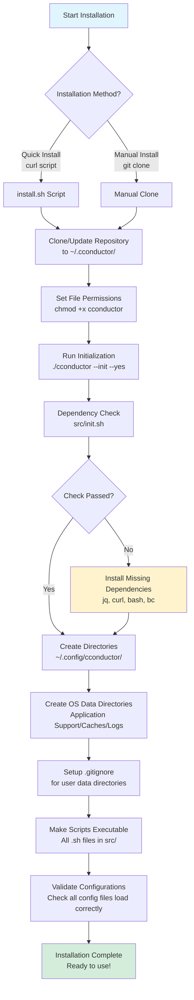

# Installation and Configuration

## How Installation Works

### Installation Flow



### What Gets Created

#### On macOS

```
~/.cconductor/                                   # Application code
    ├── cconductor                               # Main entry point
    ├── src/                                # Source code
    ├── config/*.default.json               # Default configs (git-tracked)
    └── ...

~/.config/cconductor/                            # User configs (created, empty)
    # User creates configs as needed with:
    # ./src/utils/config-loader.sh init <config-name>

~/Library/Application Support/CConductor/       # User data (created on first use)
    ├── research-sessions/
    ├── knowledge-base-custom/
    └── citations.json

~/Library/Caches/CConductor/                     # Cache (created on first use)
    └── pdfs/

~/Library/Logs/CConductor/                       # Logs (created on first use)
    └── audit.log
```

#### On Linux

```
~/.cconductor/                                   # Application code
~/.config/cconductor/                            # User configs
~/.local/share/cconductor/                       # User data
~/.cache/cconductor/                             # Cache
~/.local/state/cconductor/                       # Logs
```

### Configuration Creation

**Important**: User configs are **not** created automatically during installation!

Users create them when needed:

```bash
# List available configs
./src/utils/config-loader.sh list

# Create a custom config
./src/utils/config-loader.sh init cconductor-config

# This creates ~/.config/cconductor/cconductor-config.json
# User then edits it
vim ~/.config/cconductor/cconductor-config.json
```

**Why this approach?**

- Most users use defaults (no custom configs needed)
- Explicit opt-in for customization
- Clear separation of defaults vs user changes
- No unnecessary file creation

## Installation Methods

### Method 1: Quick Install (Recommended)

```bash
curl -fsSL https://github.com/yaniv-golan/cconductor/releases/latest/download/install.sh | bash
```

**What happens:**

1. Downloads `install.sh`
2. Clones repo to `~/.cconductor`
3. Runs `./cconductor --init --yes` (non-interactive)
4. Creates `~/.config/cconductor/` directory
5. Optionally adds to PATH

### Method 2: Manual Install (Development)

```bash
git clone https://github.com/yaniv-golan/cconductor.git
cd cconductor
./cconductor --init
```

**What happens:**

1. Clone repo to current directory
2. Run initialization (interactive)
3. Creates `~/.config/cconductor/` directory
4. User manually adds to PATH if desired

### Method 3: Custom Location

```bash
curl -fsSL https://raw.githubusercontent.com/yaniv-golan/cconductor/main/install.sh | bash -s /custom/path
```

**What happens:**

1. Installs to `/custom/path` instead of `~/.cconductor`
2. Still creates `~/.config/cconductor/` (OS-standard location)
3. User configs always in home directory regardless of install location

## First Run

```bash
./cconductor "What is quantum computing?"
```

**What happens:**

1. **Check initialization** (`check_initialization()`)
   - Checks if `~/.config/cconductor/` exists
   - If not, runs `init.sh` interactively

2. **Load configuration**
   - Loads defaults from `PROJECT_ROOT/config/*.default.json`
   - Overlays user configs from `~/.config/cconductor/*.json` (if they exist)
   - Uses merged configuration

3. **Run research**
   - Creates session in `~/Library/Application Support/CConductor/research-sessions/` (macOS)
   - Or `~/.local/share/cconductor/research-sessions/` (Linux)

## Configuration Management

### Viewing Configurations

```bash
# Show config status
./cconductor configure

# Output:
🔧 CConductor Configuration

═══════════════════════════════════════════════════════
User Config Directory: /Users/you/.config/cconductor/

Available configurations:

  • adaptive-config (using default)
  • cconductor-config (using default)
  • cconductor-modes (using default)
  • knowledge-config (using default)
  • mcp-servers (using default)
  • paths (using default)
  • research-config (using default)
  • research-modes (using default)
  • security-config (using default)

Config locations:
  Defaults:  /Users/you/.cconductor/config/*.default.json (git-tracked, don't edit)
  User:      /Users/you/.config/cconductor/*.json (customize these)

═══════════════════════════════════════════════════════

Create custom config:
  ./src/utils/config-loader.sh init <config-name>

Edit config:
  vim /Users/you/.config/cconductor/<config-name>.json

View differences:
  ./src/utils/config-loader.sh diff <config-name>

Get help:
  ./src/utils/config-loader.sh help
```

### Creating Custom Configs

```bash
# Create security config
./src/utils/config-loader.sh init security-config

# This creates ~/.config/cconductor/security-config.json
# Edit it
vim ~/.config/cconductor/security-config.json

# View your changes
./src/utils/config-loader.sh diff security-config
```

### Finding Data Locations

```bash
# Find session directory
./src/utils/path-resolver.sh resolve session_dir

# Find all paths
./src/utils/path-resolver.sh list

# Output:
Path Key                 Configured Value                        Resolved Path
─────────────────────────────────────────────────────────────────────────────────
cache_dir                ${PLATFORM_CACHE}                       /Users/you/Library/Caches/CConductor
log_dir                  ${PLATFORM_LOGS}                        /Users/you/Library/Logs/CConductor
session_dir              ${PLATFORM_DATA}/research-sessions      /Users/you/Library/Application Support/CConductor/research-sessions
...
```

## Upgrades

### Installer-Based Installation

```bash
./cconductor --update
```

**What happens:**

1. Downloads latest `install.sh`
2. Runs installer to update `~/.cconductor/`
3. Runs `init.sh` to update directories
4. **Preserves** `~/.config/cconductor/` (never touched)
5. **Preserves** `~/Library/Application Support/CConductor/` (never touched)

### Git-Based Installation

```bash
cd ~/.cconductor
git pull origin main
./cconductor --init --yes
```

**What happens:**

1. `git pull` updates code and `.default.json` files
2. `init.sh` validates/creates directories
3. **Preserves** `~/.config/cconductor/` (not in git)
4. **Preserves** `~/Library/Application Support/CConductor/` (not in project)

## Uninstallation

### Remove Application

```bash
# Installer-based
rm -rf ~/.cconductor

# Git-based
rm -rf /path/to/cconductor
```

### Keep or Remove User Data

**Keep data** (recommended):

```bash
# User configs and data are safe in home directory
# ~/.config/cconductor/
# ~/Library/Application Support/CConductor/
# Just delete application code above
```

**Remove everything** (clean slate):

```bash
# macOS
rm -rf ~/.cconductor
rm -rf ~/.config/cconductor
rm -rf ~/Library/Application\ Support/CConductor
rm -rf ~/Library/Caches/CConductor
rm -rf ~/Library/Logs/CConductor

# Linux
rm -rf ~/.cconductor  # or your install location
rm -rf ~/.config/cconductor
rm -rf ~/.local/share/cconductor
rm -rf ~/.cache/cconductor
rm -rf ~/.local/state/cconductor
```

## Multi-User Systems

Each user has their own:

- Configs: `~/.config/cconductor/`
- Data: `~/Library/Application Support/CConductor/` (or Linux equivalent)

Shared application:

- `/opt/cconductor/` or similar (system-wide install)
- All users can run it
- Each user gets their own data and configs

Example:

```bash
# Install system-wide
sudo curl -fsSL ... | bash -s /opt/cconductor

# User 1
/opt/cconductor/cconductor "research question"
# → Config: /home/user1/.config/cconductor/
# → Data: /home/user1/.local/share/cconductor/

# User 2
/opt/cconductor/cconductor "research question"
# → Config: /home/user2/.config/cconductor/
# → Data: /home/user2/.local/share/cconductor/
```

## Troubleshooting

### "Config directory not found"

```bash
# Run initialization
./cconductor --init
```

### "Can't find research sessions"

```bash
# Check configured path
./src/utils/path-resolver.sh resolve session_dir

# Verify directory exists
ls -la ~/Library/Application\ Support/CConductor/research-sessions/
```

### "No configs found"

This is **normal**! Configs are created on demand:

```bash
# Create the config you need
./src/utils/config-loader.sh init cconductor-config
```

### "Configs in wrong location"

If you have old configs in project directory:

```bash
# Check what's where
./src/utils/config-loader.sh list

# User configs should be in ~/.config/cconductor/
# NOT in PROJECT_ROOT/config/
```

## See Also

- [User Guide](USER_GUIDE.md) - Complete usage guide
- [Configuration Reference](CONFIGURATION_REFERENCE.md) - All config options
- [Upgrade Guide](../UPGRADE.md) - Update instructions
- [Troubleshooting](TROUBLESHOOTING.md) - Common issues
