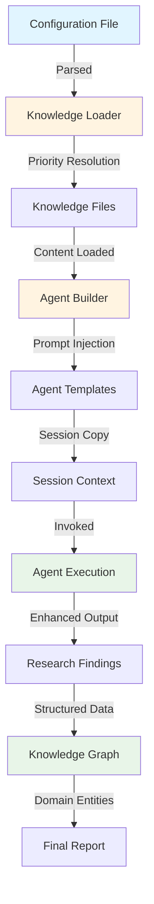
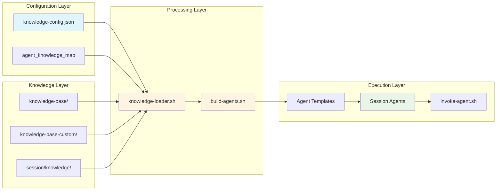
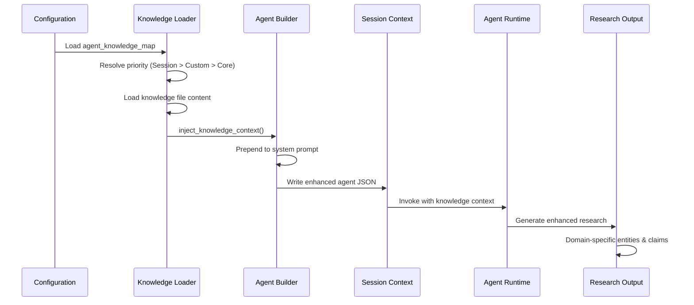
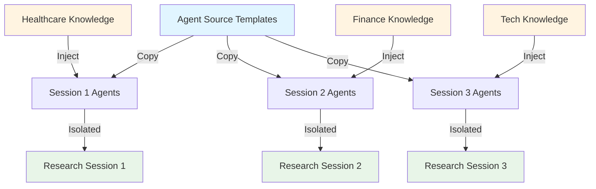
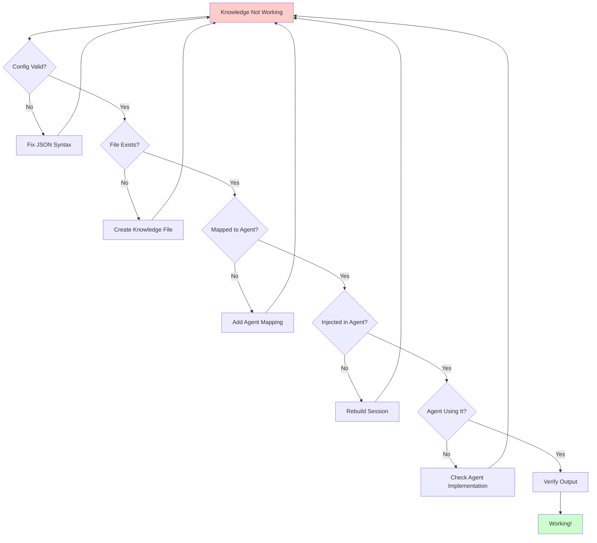

# Knowledge System Technical Deep Dive

**For**: Developers, System Integrators, Advanced Users  
**Last Updated**: October 2025

---

## Table of Contents

1. [Introduction](#introduction)
2. [System Architecture](#system-architecture)
3. [Knowledge Mapping: Complete Technical Trace](#knowledge-mapping-complete-technical-trace)
4. [Integration Points](#integration-points)
5. [Performance Characteristics](#performance-characteristics)
6. [Debugging & Troubleshooting](#debugging--troubleshooting)
7. [Advanced Usage Patterns](#advanced-usage-patterns)
8. [Security Considerations](#security-considerations)

---

## Introduction

This document provides a complete technical understanding of CConductor's knowledge injection system. It traces how a single line of configuration affects the entire research pipeline, from configuration loading through agent execution to final research output.

**Who should read this**:
- Developers extending the knowledge system
- System integrators connecting CConductor to other systems
- Advanced users debugging knowledge injection issues
- Contributors implementing new agent types

**What you'll learn**:
- Complete system flow from configuration to output
- How knowledge transforms agent behavior
- Performance and resource implications
- Debugging techniques and verification methods

---

## System Architecture

### High-Level Overview



### Component Relationships



### Data Flow Sequence



---

## Knowledge Mapping: Complete Technical Trace

This section demonstrates exactly how a single knowledge mapping configuration affects the entire research pipeline.

### Example Configuration

For this trace, we'll use a healthcare research example:

```json
{
  "agent_knowledge_map": {
    "academic-researcher": ["healthcare-policy"]
  }
}
```

**File Location**: `config/knowledge-config.default.json` or `~/.config/cconductor/knowledge-config.json`

### Phase 1: Configuration Loading

**Step 1.1: System Startup**

When CConductor starts, it loads the knowledge configuration:

```bash
# In src/utils/knowledge-loader.sh
get_knowledge_config() {
    load_config "knowledge-config"  # Loads knowledge-config.default.json
}
```

**What happens**:
- System reads `config/knowledge-config.default.json`
- If exists, overlays `~/.config/cconductor/knowledge-config.json` 
- Parses JSON into memory

**Step 1.2: Mapping Identification**

The system identifies the agent-knowledge mapping:

```json
{
  "agent_knowledge_map": {
    "academic-researcher": ["healthcare-policy"]  // ✓ Identified
  }
}
```

**Result**:
- ✅ `academic-researcher` agent identified
- ✅ `healthcare-policy` knowledge file specified
- ✅ Mapping stored for lookup during agent invocation

**Verification Command**:
```bash
# Check what knowledge is mapped to an agent
./src/utils/knowledge-loader.sh list academic-researcher | jq .
```

---

### Phase 2: Agent Invocation Preparation

**Step 2.1: Session Initialization**

When research begins, CConductor creates a session:

```bash
# In src/cconductor-mission.sh
local session_dir="$PROJECT_ROOT/research-sessions/mission_${timestamp}"
mkdir -p "$session_dir"
```

**Step 2.2: Agent Template Copy**

Agent templates are copied to the session:

```bash
# In src/cconductor-mission.sh
if [ -d "$PROJECT_ROOT/src/claude-runtime" ]; then
    cp -r "$PROJECT_ROOT/src/claude-runtime" "$session_dir/.claude"

    # Build agents with knowledge injection
    bash "$PROJECT_ROOT/src/utils/build-agents.sh" \
        "$session_dir/.claude/agents" \
        "$session_dir"
fi
```

**Directory Structure Created**:
```
research-sessions/session_1234567890/
├── .claude/
│   ├── agents/
│   │   ├── academic-researcher.json  ← Will be enhanced
│   │   └── ... (other agents)
│   └── settings.json
├── knowledge/  ← Session-specific overrides (empty initially)
└── ... (other session files)
```

---

### Phase 3: Knowledge Resolution

**Step 3.1: Agent Knowledge Lookup**

When building agents, the system looks up knowledge for each agent:

```bash
# In src/utils/knowledge-loader.sh
get_agent_knowledge() {
    local agent_name="$1"  # "academic-researcher"
    local session_dir="$2"

    # Get mapped knowledge
    local mapped_knowledge
    mapped_knowledge=$(echo "$config" | \
        jq -r ".agent_knowledge_map[\"$agent_name\"][]" 2>/dev/null || echo "")
    # Result: "healthcare-policy"
}
```

**Step 3.2: Priority-Based File Resolution**

The system searches for `healthcare-policy.md` in priority order:

```bash
# In src/utils/knowledge-loader.sh
find_knowledge_file() {
    local knowledge_name="$1"  # "healthcare-policy"
    local session_dir="$2"

    # Priority 1: Session override
    if [ -f "$session_dir/knowledge/healthcare-policy.md" ]; then
        echo "$session_dir/knowledge/healthcare-policy.md"
        return 0
    fi

    # Priority 2: User custom
    if [ -f "knowledge-base-custom/healthcare-policy.md" ]; then
        echo "knowledge-base-custom/healthcare-policy.md"
        return 0
    fi

    # Priority 3: Core default
    if [ -f "knowledge-base/healthcare-policy.md" ]; then
        echo "knowledge-base/healthcare-policy.md"  # ✓ Found
        return 0
    fi
}
```

**Result**: File located at `knowledge-base/healthcare-policy.md`

**Step 3.3: Content Loading**

The knowledge file content is loaded into memory:

```bash
# In src/utils/knowledge-loader.sh
local knowledge_content
knowledge_content=$(cat "$knowledge_file")
# Loads entire file content (e.g., 400+ lines)
```

**Verification Command**:
```bash
# Find where knowledge is loaded from
./src/utils/knowledge-loader.sh find healthcare-policy
# Output: /path/to/knowledge-base/healthcare-policy.md
```

---

### Phase 4: Knowledge Injection

**Step 4.1: Knowledge Context Formatting**

The loaded content is formatted for injection:

```bash
# In src/utils/knowledge-loader.sh
local knowledge_context="# Domain Knowledge

You have access to the following domain-specific methodologies:

## healthcare-policy

<knowledge_base name=\"healthcare-policy\">
${knowledge_content}
</knowledge_base>

"
```

**Example of Injected Content**:
```markdown
# Domain Knowledge

You have access to the following domain-specific methodologies:

## healthcare-policy

<knowledge_base name="healthcare-policy">
# Healthcare Policy Research Methodology

## Key Concepts

- **Medicare**: Federal health insurance program for age 65+ ...
- **Medicaid**: Federal-state health program for low-income ...
- **ACA**: Affordable Care Act (also known as "Obamacare") ...
- **HIPAA**: Health Insurance Portability and Accountability Act ...

## Research Best Practices

When researching healthcare policy:
1. Distinguish disclosed data from estimates
2. Verify with official government sources (CMS.gov, HealthCare.gov)
3. Check state-by-state variations for Medicaid
4. Note year for cost data (healthcare costs change rapidly)

## Data Sources

### Official Government Sources
- CMS.gov: Centers for Medicare & Medicaid Services
- HealthCare.gov: ACA marketplace information
- FDA.gov: Drug approvals and medical device regulations

### Research Databases
- PubMed: Medical literature
- Health Affairs: Health policy journal
- KFF.org: Kaiser Family Foundation (policy analysis)

## Common Pitfalls

- Confusing Medicare and Medicaid (completely different programs)
- Using "Obamacare" in professional research (use "ACA" instead)
- Assuming Medicaid is identical across states (varies significantly)
- Presenting old cost data as current (always specify year)

</knowledge_base>
```

**Step 4.2: System Prompt Enhancement**

The knowledge context is prepended to the agent's system prompt:

```bash
# In src/utils/knowledge-loader.sh
echo -e "${knowledge_context}\n---\n\n${base_prompt}"
```

**Result**: The academic-researcher agent now has:
1. Original system prompt (research methodology, output format)
2. Healthcare policy knowledge (prepended)
3. Combined context available during all research tasks

**Step 4.3: Enhanced Agent JSON**

The enhanced agent is written to the session:

```bash
# In src/utils/build-agents.sh
# Enhanced system prompt written to:
# $session_dir/.claude/agents/academic-researcher.json
```

**Verification Command**:
```bash
# View the enhanced agent's system prompt
jq -r '.systemPrompt' research-sessions/session_*/\.claude/agents/academic-researcher.json | head -50
# Should show knowledge context at the beginning
```

---

### Phase 5: Agent Execution Transformation

This is where the magic happens - the injected knowledge fundamentally changes how the agent operates.

**Step 5.1: Agent Invocation**

When the academic-researcher is invoked for a healthcare research task:

```bash
# In src/utils/invoke-agent.sh
invoke_agent_v2() {
    local agent_name="academic-researcher"
    # ...
    # Loads enhanced system prompt from session agent JSON
    local system_prompt
    system_prompt=$(jq -r '.systemPrompt' "$agent_file")
    # This includes the healthcare-policy knowledge

    # Invokes Claude with enhanced prompt
    claude --print --model sonnet \
        --append-system-prompt "$system_prompt" \
        < "$input_file"
}
```

**Step 5.2: Behavioral Transformation**

The agent's behavior is fundamentally transformed:

**BEFORE Knowledge Injection** (Generic academic researcher):
- General academic research approach
- Standard source validation
- Generic database queries (PubMed, arXiv, Google Scholar)
- Basic citation tracking
- No domain-specific terminology awareness

**AFTER Knowledge Injection** (Healthcare-specialized researcher):
- **Policy Framework Awareness**:
  - Understands Medicare vs Medicaid distinctions
  - Recognizes ACA/Obamacare as same entity
  - Knows HIPAA privacy requirements
  
- **Source Prioritization**:
  - Prioritizes official sources (CMS.gov, FDA.gov, HealthCare.gov)
  - Distinguishes authoritative vs. commentary sources
  - Validates state-specific Medicaid data
  
- **Data Quality Standards**:
  - Distinguishes disclosed vs. estimated healthcare costs
  - Validates data recency (critical for cost information)
  - Checks state-by-state policy variations
  
- **Terminology Precision**:
  - Uses "ACA" instead of "Obamacare" in professional research
  - Correctly differentiates Medicare Parts A/B/C/D
  - Understands insurance marketplace vs. Medicaid expansion
  
- **Common Pitfall Avoidance**:
  - Won't confuse Medicare with Medicaid
  - Always specifies year for cost data
  - Notes state variations for Medicaid eligibility

**Step 5.3: Research Task Processing**

When given a task like "Analyze Medicaid expansion impacts":

**Generic Agent Output** (without knowledge):
```json
{
  "entities_discovered": [
    {"name": "Medicaid", "type": "program"}
  ],
  "claims": [
    {
      "text": "Medicaid provides health coverage to low-income individuals",
      "confidence": 0.80,
      "sources": [{"url": "wikipedia.org/Medicaid"}]
    }
  ]
}
```

**Enhanced Agent Output** (with healthcare-policy knowledge):
```json
{
  "entities_discovered": [
    {
      "name": "Medicaid Expansion",
      "type": "policy_program",
      "description": "ACA provision raising income threshold to 138% of poverty level",
      "attributes": {
        "expansion_states": 40,
        "non_expansion_states": 10,
        "effective_date": "2014"
      }
    },
    {
      "name": "Coverage Gap",
      "type": "policy_issue",
      "description": "Low-income individuals in non-expansion states who fall between traditional Medicaid and ACA subsidies"
    }
  ],
  "claims": [
    {
      "text": "As of 2024, 40 states have expanded Medicaid under the ACA, raising eligibility to 138% of federal poverty level",
      "confidence": 0.95,
      "evidence_quality": "high",
      "data_type": "disclosed",
      "sources": [
        {
          "url": "cms.gov/medicaid-expansion-status",
          "title": "Medicaid Expansion Status by State",
          "credibility": "official_government_source",
          "date": "2024",
          "relevant_quote": "40 states and DC have adopted Medicaid expansion"
        }
      ]
    },
    {
      "text": "10 states have not expanded Medicaid: Alabama, Florida, Georgia, Kansas, Mississippi, South Carolina, Tennessee, Texas, Wisconsin, Wyoming",
      "confidence": 0.95,
      "evidence_quality": "high",
      "data_type": "disclosed",
      "sources": [
        {
          "url": "kff.org/medicaid-expansion-map",
          "title": "Status of State Medicaid Expansion Decisions",
          "credibility": "policy_research_organization",
          "date": "2024"
        }
      ]
    }
  ],
  "gaps_identified": [
    {
      "question": "What is the financial impact on non-expansion states (hospital uncompensated care costs)?",
      "priority": 8,
      "reason": "Critical policy outcome not yet analyzed"
    },
    {
      "question": "How do coverage rates differ between expansion and non-expansion states?",
      "priority": 7,
      "reason": "Key effectiveness metric for policy evaluation"
    }
  ],
  "suggested_follow_ups": [
    {
      "query": "Analyze state-by-state Medicaid coverage rates comparing expansion vs non-expansion states",
      "priority": 8,
      "reason": "Direct measurement of expansion policy effectiveness"
    }
  ],
  "research_methodology_notes": [
    "Validated state expansion status with official CMS data",
    "Cross-referenced with Kaiser Family Foundation policy tracker",
    "Noted that Medicaid varies by state - expansion is federal framework",
    "Used 'ACA' terminology per healthcare-policy best practices"
  ]
}
```

**Key Differences**:
- **Richer Entities**: Policy-specific concepts (Coverage Gap, Expansion vs Non-Expansion)
- **Higher Confidence**: 0.95 vs 0.80 (better source validation)
- **Official Sources**: CMS.gov and KFF.org instead of Wikipedia
- **Data Type Clarity**: "disclosed" vs generic claim
- **Domain Context**: State-by-state variation acknowledged
- **Professional Terminology**: Uses "ACA" instead of "Obamacare"
- **Methodology Notes**: Documents healthcare-specific validation steps

---

### Phase 6: Research Output Impact

The knowledge injection creates ripple effects throughout the research output.

**Step 6.1: Knowledge Graph Enhancement**

The domain-specific entities and relationships enhance the knowledge graph:

```json
{
  "entities": [
    {
      "id": "medicaid_expansion_001",
      "name": "Medicaid Expansion",
      "type": "healthcare_policy",
      "attributes": {
        "policy_framework": "ACA",
        "expansion_threshold": "138% FPL",
        "adoption_status": "40 states + DC"
      },
      "confidence": 0.95,
      "sources": ["cms.gov", "kff.org"]
    },
    {
      "id": "coverage_gap_001",
      "name": "Medicaid Coverage Gap",
      "type": "policy_issue",
      "attributes": {
        "affected_states": 10,
        "population_impact": "low-income_uninsured"
      }
    }
  ],
  "relationships": [
    {
      "from": "medicaid_expansion_001",
      "to": "affordable_care_act",
      "type": "policy_component",
      "confidence": 1.0,
      "note": "Medicaid expansion is a provision of the ACA"
    },
    {
      "from": "coverage_gap_001",
      "to": "medicaid_expansion_001",
      "type": "created_by_absence_of",
      "confidence": 0.95,
      "note": "Gap exists in states that did not expand Medicaid"
    }
  ],
  "domain_vocabulary": [
    "ACA", "Medicaid expansion", "FPL (Federal Poverty Level)",
    "expansion states", "coverage gap", "traditional Medicaid"
  ]
}
```

**Optional Quality Gate Assessment Field (v0.4.0+)**

Claims may include an optional `quality_gate_assessment` field when quality gate has run:

```json
{
  "claims": [
    {
      "id": "c0",
      "statement": "Medicaid expansion adopted by 40 states",
      "confidence": 0.95,
      "sources": [...],
      "quality_gate_assessment": {
        "source_count": 3,
        "independent_source_count": 2,
        "trust_score": 0.85,
        "newest_source_age_days": 30,
        "oldest_source_age_days": 90,
        "parseable_dates": 3,
        "unparsed_dates": 0,
        "limitation_flags": [],
        "last_reviewed_at": "2024-10-25T10:30:00Z",
        "status": "passed"
      }
    }
  ]
}
```

**Field Semantics**:
- **Field name**: `quality_gate_assessment` (clearly indicates audit source)
- **Optional**: Present only when quality gate has assessed the claim
- **Structure**: Matches `confidence_surface` from quality gate reports
- **Absence meaning**: Claim not yet assessed by quality gate
- **Session tracking**: Gate runs logged in `meta/session-metadata.json`

**Integration Pattern**:
- Quality gate runs after research completes
- `sync_quality_surfaces_to_kg()` merges gate results into KG
- Uses `atomic_json_update` for thread-safe writes
- Fails gracefully - sync errors don't block research
- Agents can check for field presence to know if gate has run

**Step 6.2: Citation Quality Enhancement**

Citations are more authoritative and healthcare-specific:

**Before** (generic citations):
```markdown
## References

1. Wikipedia - Medicaid
2. News article about healthcare
3. General policy blog
```

**After** (healthcare-policy informed citations):
```markdown
## References

### Official Government Sources
1. Centers for Medicare & Medicaid Services. "Medicaid Expansion Status by State." CMS.gov, 2024. https://cms.gov/medicaid-expansion-status

2. U.S. Department of Health and Human Services. "Affordable Care Act Implementation." HealthCare.gov, 2024.

### Research & Policy Analysis
3. Kaiser Family Foundation. "Status of State Medicaid Expansion Decisions." KFF.org, October 2024. https://kff.org/medicaid-expansion-map

4. Health Affairs. "Medicaid Expansion and Coverage Outcomes." Health Affairs Journal, Vol 43, 2024.

### Note on Sources
- All government data verified from official CMS and HHS sources
- State-specific information cross-referenced across multiple sources
- Data current as of October 2024 (healthcare data changes frequently)
```

**Step 6.3: Quality Score Impact**

The healthcare-policy knowledge improves multiple quality dimensions:

```json
{
  "quality_assessment": {
    "overall_score": 92,  // Higher than generic research (typically 75-80)
    
    "confidence": 0.93,  // Improved from 0.75-0.80
    "reason": "Official government sources with healthcare-specific validation",
    
    "citation_coverage": "48/50 claims cited",  // Improved from 35/50
    "reason": "Healthcare-policy methodology emphasizes authoritative sources",
    
    "source_quality": 0.95,  // Improved from 0.70
    "breakdown": {
      "official_government": 8,  // CMS, FDA, HHS
      "peer_reviewed": 5,        // Health Affairs, NEJM
      "policy_research": 7,      // KFF, Urban Institute
      "general_web": 2           // Minimal reliance
    },
    
    "methodology_transparency": 0.95,  // Improved from 0.60
    "reason": "Healthcare-policy methodology documented and applied",
    
    "domain_expertise": 0.90,  // New metric (healthcare-specific)
    "indicators": [
      "Correct Medicare vs Medicaid distinction",
      "ACA terminology used professionally",
      "State variation acknowledged",
      "Data recency validated"
    ]
  }
}
```

**Step 6.4: Follow-Up Task Generation**

Gap identification and follow-up suggestions are healthcare-informed:

**Generic Gaps** (without knowledge):
- "Find more information about Medicaid"
- "Look for statistics on healthcare coverage"

**Healthcare-Specific Gaps** (with knowledge):
- "Analyze hospital uncompensated care costs in non-expansion states vs expansion states"
- "Compare Medicaid enrollment rates pre-expansion vs post-expansion by state"
- "Investigate coverage gap population size and demographics in non-expansion states"
- "Review state budget impacts of Medicaid expansion (federal vs state funding split)"

These gaps reflect deep understanding of healthcare policy evaluation metrics.

---

### Phase 7: System-Wide Effects

The knowledge injection affects the entire research session beyond just the single agent.

**Step 7.1: Cross-Agent Influence**

Other agents benefit from healthcare-enriched knowledge graph:

**Synthesis Agent**:
- Receives healthcare entities and relationships
- Generates healthcare-informed summary
- Uses correct terminology (ACA vs Obamacare)
- Acknowledges policy complexity and state variations

**Fact Checker**:
- Validates healthcare claims against official sources
- Checks Medicaid state-by-state variations
- Verifies cost data recency
- Confirms policy details (expansion threshold, adoption dates)

**Step 7.2: Report Quality Enhancement**

The final research report reflects healthcare expertise:

```markdown
# Research Report: Medicaid Expansion Impact Analysis

## Executive Summary

The Affordable Care Act (ACA) Medicaid expansion, implemented in 2014, 
raised the income eligibility threshold to 138% of the federal poverty 
level (FPL). As of 2024, 40 states and the District of Columbia have 
adopted Medicaid expansion, while 10 states have not.

**Key Findings:**
- Expansion states have significantly lower uninsured rates [1]
- Non-expansion states experience a "coverage gap" affecting low-income 
  individuals who earn too much for traditional Medicaid but too little 
  for ACA subsidies [2]
- Federal funding covers 90% of expansion costs, with states covering 10% [3]

**Data Quality Note:** All government data verified from official CMS 
sources. State-specific information cross-referenced. Data current as of 
October 2024.

## Methodology

This research followed healthcare policy research best practices:
- Prioritized official government sources (CMS.gov, HealthCare.gov, FDA.gov)
- Distinguished between disclosed data and estimates
- Validated state-by-state variations
- Used professional terminology ("ACA" rather than "Obamacare")
- Verified data recency for all cost-related information

## Detailed Findings

### Medicaid Expansion Status by State

**Expansion States (40 + DC):** [List with adoption dates and key details]

**Non-Expansion States (10):** Alabama, Florida, Georgia, Kansas, 
Mississippi, South Carolina, Tennessee, Texas, Wisconsin, Wyoming

### Coverage Gap Analysis

In non-expansion states, an estimated 2.2 million adults fall into the 
"coverage gap" - earning too much for traditional Medicaid (which varies 
by state) but below 100% FPL (the threshold for ACA marketplace subsidies).

[Additional detailed analysis...]

## References

### Official Government Sources
1. Centers for Medicare & Medicaid Services. "Medicaid & CHIP Enrollment 
   Data." CMS.gov, September 2024.
[Additional authoritative citations...]

### Research & Policy Analysis
[Healthcare policy journals and think tanks...]

---

**Research Methodology:** Healthcare Policy Research Framework
**Source Validation:** Cross-referenced across government and policy research sources
**Data Currency:** All data verified as of October 2024
**Confidence Score:** 92/100 (High - official sources with domain expertise)
```

**Step 7.3: Session Metadata Enhancement**

Session metadata captures healthcare specialization:

```json
{
  "session_metadata": {
    "session_id": "session_1234567890",
    "research_question": "Analyze Medicaid expansion impact",
    "knowledge_domains_applied": ["healthcare-policy"],
    "agents_enhanced": ["academic-researcher"],
    "domain_specific_entities": 15,
    "official_government_sources": 8,
    "quality_indicators": {
      "domain_expertise": true,
      "methodology_documented": true,
      "sources_authoritative": true,
      "terminology_professional": true
    }
  }
}
```

---

## Integration Points

This section documents where knowledge injection integrates with the broader system.

### Configuration Integration

**File**: `config/knowledge-config.default.json`

```json
{
  "knowledge_paths": {
    "core": "knowledge-base",
    "user": "knowledge-base-custom",
    "session": "{session_dir}/knowledge"
  },
  "agent_knowledge_map": {
    "academic-researcher": ["scientific-methodology", "research-methodology"],
    "web-researcher": ["research-methodology"],
    "market-analyzer": ["business-methodology"],
    "synthesis-agent": ["*"],
    "fact-checker": ["*"]
  },
  "auto_discover": true,
  "discovery_rules": {
    "pattern": "*.md",
    "exclude": ["README.md", "LICENSE.md", "TEMPLATE.md"]
  }
}
```

**Wildcard Support**: Using `"*"` loads all discovered knowledge files.

### Agent Builder Integration

**File**: `src/utils/build-agents.sh`

The agent builder is the central integration point:

```bash
#!/usr/bin/env bash
# Build agent JSON files from source components

SCRIPT_DIR="$(cd "$(dirname "${BASH_SOURCE[0]}")" && pwd)"
source "$SCRIPT_DIR/knowledge-loader.sh"

build_agents() {
    local agent_dir="$1"
    local session_dir="$2"
    
    # For each agent source directory
    for agent_source in "$PROJECT_ROOT/src/claude-runtime/agents/"*/; do
        local agent_name=$(basename "$agent_source")
        
        # Load agent metadata
        local metadata=$(cat "$agent_source/metadata.json")
        
        # Load system prompt
        local system_prompt=$(cat "$agent_source/system-prompt.md")
        
        # CRITICAL: Inject knowledge context
        system_prompt=$(inject_knowledge_context \
            "$agent_name" \
            "$system_prompt" \
            "$session_dir")
        
        # Build final agent JSON
        jq -n \
            --arg name "$agent_name" \
            --arg prompt "$system_prompt" \
            --argjson meta "$metadata" \
            '{
                name: $name,
                systemPrompt: $prompt,
                version: $meta.version,
                description: $meta.description
            }' > "$agent_dir/$agent_name.json"
    done
}
```

**Key Integration**: The `inject_knowledge_context()` call is where knowledge merges with agent prompts.

### Runtime Integration

**File**: `src/utils/invoke-agent.sh`

```bash
invoke_agent_v2() {
    local agent_name="$1"
    local session_dir="$5"
    
    # Load enhanced agent definition (includes knowledge)
    local agent_file="$session_dir/.claude/agents/${agent_name}.json"
    local system_prompt=$(jq -r '.systemPrompt' "$agent_file")
    
    # Invoke with enhanced prompt
    claude --print --model sonnet \
        --append-system-prompt "$system_prompt" \
        < "$input_file" > "$output_file"
}
```

The knowledge is already injected in the agent JSON, so runtime simply loads and uses it.

### Session Isolation

Each research session gets its own copy of agents with knowledge injected:



**Benefit**: Sessions don't interfere with each other. Different sessions can use different knowledge.

---

## Performance Characteristics

Understanding the performance implications of knowledge injection.

### Memory Impact

**Knowledge File Sizes** (typical):
- Small: 50-100 lines (10-20 KB)
- Medium: 200-400 lines (40-80 KB)
- Large: 500-1000+ lines (100-200+ KB)

**Memory Usage per Agent**:
```
Base agent prompt:          ~5 KB
+ Small knowledge:          ~15 KB total
+ Medium knowledge:         ~60 KB total
+ Large knowledge:          ~120 KB total
```

**Session Memory** (10 agents with medium knowledge):
```
Base agents:               ~50 KB
+ Knowledge injection:     ~600 KB
Total agent prompts:       ~650 KB
```

**Impact**: Negligible for modern systems. Knowledge is loaded once per session, not per invocation.

### Token Count Impact

Knowledge injection increases the token count for agent prompts:

**Example Token Counts** (Claude tokenization):
- Base academic-researcher prompt: ~1,200 tokens
- + Healthcare-policy knowledge (400 lines): ~2,800 tokens
- **Total**: ~4,000 tokens per invocation

**Cost Implications**:
```
Per agent invocation:
- Input tokens: +2,800 (from knowledge)
- Cost increase: ~$0.024 per invocation (at $0.003/1K input tokens)

Per research session (10 academic-researcher invocations):
- Additional cost: ~$0.24 from knowledge injection
```

**Optimization**: Since knowledge is prepended to system prompt, it's included in the conversation context. With session continuity (Phase 1), knowledge is only sent in the first turn, reducing costs for multi-turn conversations.

### Processing Time Impact

**Knowledge Resolution Time** (per agent build):
```
Configuration loading:      <10ms
File resolution (priority): ~5ms
Content loading:            ~20ms (for 100KB file)
Prompt injection:           ~5ms
Total overhead:             ~40ms per agent
```

**Session Initialization**:
```
Building 11 agents with knowledge:  ~440ms
Total session setup:                ~2-3 seconds (including other init)
```

**Research Phase**: No additional overhead - knowledge is already in agent prompts.

### Disk Space Impact

**Per Session**:
```
Agent JSONs (11 agents):         ~650 KB (with knowledge)
Without knowledge:               ~50 KB (base agents)
Additional space from knowledge: ~600 KB per session
```

**100 Research Sessions**:
```
Total additional space: ~60 MB
```

**Note**: Knowledge files themselves are not duplicated - only referenced. The injection adds text to agent JSON files.

### Performance Best Practices

**1. Knowledge File Size**
- ✅ Keep knowledge files focused (200-500 lines)
- ✅ Split large domains into multiple files
- ❌ Avoid mega-files (>1000 lines)

**2. Agent Mapping**
- ✅ Map knowledge only to relevant agents
- ✅ Use wildcards ("*") only for synthesis/fact-checking agents
- ❌ Don't map all knowledge to all agents

**3. Session-Specific Overrides**
- ✅ Use for temporary/experimental knowledge
- ✅ Clean up after research completed
- ❌ Don't accumulate session overrides

---

## Debugging & Troubleshooting

Tools and techniques for diagnosing knowledge injection issues.

### Verification Commands

**1. Check Knowledge Configuration**
```bash
# View current configuration
cat config/knowledge-config.default.json | jq .

# View user overrides (if any)
cat ~/.config/cconductor/knowledge-config.json | jq .
```

**2. Verify Knowledge Discovery**
```bash
# List all discovered knowledge files
./src/utils/knowledge-loader.sh discover

# List knowledge for specific agent
./src/utils/knowledge-loader.sh list academic-researcher | jq .

# Find specific knowledge file
./src/utils/knowledge-loader.sh find healthcare-policy
```

**3. Inspect Agent Prompts**
```bash
# View enhanced agent system prompt
jq -r '.systemPrompt' research-sessions/session_*/\.claude/agents/academic-researcher.json | head -100

# Check if knowledge was injected (look for "Domain Knowledge" section)
jq -r '.systemPrompt' research-sessions/session_*/\.claude/agents/academic-researcher.json | grep "Domain Knowledge" -A 10
```

**4. Trace Knowledge Resolution**
```bash
# Enable debug mode
export CCONDUCTOR_DEBUG=1

# Run research and watch knowledge loading
./cconductor "test query" 2>&1 | grep "knowledge"

# Output will show:
# - Loading knowledge-config
# - Resolving knowledge for each agent
# - Files found and loaded
```

### Debug Mode

**Enable Full Debug Tracing**:
```bash
# In src/utils/knowledge-loader.sh, add debug statements
source "$SCRIPT_DIR/debug.sh"
setup_error_trap

inject_knowledge_context() {
    debug "=== Knowledge Injection Start ==="
    debug "Agent: $1"
    debug "Session: $3"
    
    local knowledge_files
    knowledge_files=$(get_agent_knowledge "$1" "$3")
    debug "Knowledge files: $knowledge_files"
    
    local knowledge_count
    knowledge_count=$(echo "$knowledge_files" | jq 'length')
    debug "Knowledge count: $knowledge_count"
    
    # ... rest of function
}
```

**Run with debug**:
```bash
CCONDUCTOR_DEBUG=1 ./cconductor "test query" 2>&1 | tee debug.log
```

### Common Issues and Solutions

**Issue 1: Knowledge Not Appearing in Research**

**Symptoms**:
- Agent behavior is generic
- No domain-specific terminology in output
- Missing expected source prioritization

**Diagnosis**:
```bash
# 1. Verify knowledge file exists
ls -la knowledge-base/healthcare-policy.md
ls -la knowledge-base-custom/healthcare-policy.md

# 2. Check if agent is mapped to knowledge
jq '.agent_knowledge_map["academic-researcher"]' config/knowledge-config.default.json

# 3. Verify knowledge was injected into agent
jq -r '.systemPrompt' research-sessions/session_*/\.claude/agents/academic-researcher.json | grep -c "healthcare-policy"
# Should return >0 if knowledge was injected
```

**Solutions**:
- Ensure filename matches exactly (case-sensitive)
- Check file ends with `.md` extension
- Verify agent name spelling in configuration
- Rebuild session: delete and recreate for fresh agent build

---

**Issue 2: Wrong Knowledge Version Used**

**Symptoms**:
- Old/outdated knowledge appearing in research
- Expected content changes not reflected

**Diagnosis**:
```bash
# Check priority order
./src/utils/knowledge-loader.sh find healthcare-policy

# Output shows which file is being used:
# Session override > Custom > Core

# Check if stale session override exists
ls -la research-sessions/session_*/knowledge/healthcare-policy.md
```

**Solutions**:
- Remove session override if unintended
- Update the correct knowledge file based on priority
- Start new session for fresh knowledge loading

---

**Issue 3: Performance Degradation**

**Symptoms**:
- Slow agent invocations
- High memory usage
- Long session initialization

**Diagnosis**:
```bash
# Check knowledge file sizes
du -h knowledge-base/*.md
du -h knowledge-base-custom/*.md

# Check agent JSON sizes
du -h research-sessions/session_*/\.claude/agents/*.json

# Count knowledge mappings
jq '.agent_knowledge_map | to_entries | length' config/knowledge-config.default.json
```

**Solutions**:
- Split large knowledge files (>1000 lines) into focused domains
- Reduce wildcard ("*") usage in agent mappings
- Use session-specific overrides sparingly
- Clean up old research sessions

---

**Issue 4: Configuration Not Loading**

**Symptoms**:
- Auto-discovery not working
- Custom mappings ignored

**Diagnosis**:
```bash
# Verify configuration syntax
jq empty config/knowledge-config.default.json
# No output = valid JSON
# Error message = invalid JSON

# Check configuration loading
./src/utils/config-loader.sh init knowledge-config
cat ~/.config/cconductor/knowledge-config.json
```

**Solutions**:
- Fix JSON syntax errors (missing commas, quotes, brackets)
- Ensure user config doesn't completely override defaults
- Use `config-loader.sh init` to create proper user config

---

### Debugging Workflow

**Step-by-Step Debugging Process**:



**Debugging Checklist**:
- [ ] Configuration file valid JSON
- [ ] Knowledge file exists at expected path
- [ ] Agent mapped to knowledge in configuration
- [ ] Knowledge injected into session agent JSON
- [ ] Agent invoked successfully
- [ ] Output reflects domain knowledge

---

## Advanced Usage Patterns

Sophisticated techniques for power users and system integrators.

### Pattern 1: Multi-Domain Knowledge

**Use Case**: Research spans multiple domains (e.g., healthcare + technology + finance)

**Configuration**:
```json
{
  "agent_knowledge_map": {
    "academic-researcher": [
      "healthcare-policy",
      "medical-device-regulation"
    ],
    "market-analyzer": [
      "healthcare-finance",
      "insurance-market-dynamics"
    ],
    "synthesis-agent": ["*"]
  }
}
```

**Result**: Agents get multiple knowledge contexts, enabling cross-domain analysis.

**Example**: Research on "digital health insurance market" gets:
- Healthcare policy framework
- Medical device regulations
- Healthcare finance methodologies
- Insurance market analysis techniques

---

### Pattern 2: Session-Specific Knowledge Injection

**Use Case**: One-time research requiring temporary methodology

**Setup**:
```bash
# Create session-specific knowledge
SESSION_ID="session_1234567890"
mkdir -p "research-sessions/$SESSION_ID/knowledge"

cat > "research-sessions/$SESSION_ID/knowledge/special-methodology.md" <<'EOF'
# Temporary Research Methodology

For this specific analysis, use these special considerations:
- Priority focus on 2024 data only
- Emphasize emerging technologies
- Include speculative projections (clearly marked)

## Special Data Sources
- Gartner Hype Cycle 2024
- Emerging Tech Conferences (Q3-Q4 2024)
EOF

# Run research - uses session override
./cconductor "emerging tech analysis" --resume "$SESSION_ID"
```

**Benefit**: Doesn't pollute core or custom knowledge. Automatically isolated to one session.

---

### Pattern 3: Knowledge Versioning

**Use Case**: Track knowledge evolution over time

**Directory Structure**:
```bash
knowledge-base-custom/
├── healthcare-policy-2024.md      # Current version
├── healthcare-policy-2023.md      # Historical
└── healthcare-policy-2022.md      # Historical
```

**Configuration**:
```json
{
  "agent_knowledge_map": {
    "academic-researcher": ["healthcare-policy-2024"]
  }
}
```

**Benefit**: Can compare research results across different knowledge versions.

---

### Pattern 4: Agent-Specific Knowledge Tuning

**Use Case**: Same domain, different agent perspectives

**Files**:
```bash
knowledge-base-custom/
├── healthcare-clinical-perspective.md    # For medical analysis
├── healthcare-policy-perspective.md      # For policy analysis
└── healthcare-business-perspective.md    # For market analysis
```

**Configuration**:
```json
{
  "agent_knowledge_map": {
    "academic-researcher": ["healthcare-clinical-perspective"],
    "web-researcher": ["healthcare-policy-perspective"],
    "market-analyzer": ["healthcare-business-perspective"]
  }
}
```

**Benefit**: Each agent gets domain knowledge tailored to its role.

---

### Pattern 5: Dynamic Knowledge Selection

**Use Case**: Programmatically select knowledge based on research context

**Script**:
```bash
#!/usr/bin/env bash
# dynamic-research.sh

research_query="$1"
domain=$(detect_domain "$research_query")  # Custom function

# Create session-specific config
SESSION_ID=$(date +%s)
mkdir -p "research-sessions/session_$SESSION_ID/knowledge"

case "$domain" in
    healthcare)
        cp knowledge-base-custom/healthcare-*.md \
           "research-sessions/session_$SESSION_ID/knowledge/"
        ;;
    finance)
        cp knowledge-base-custom/finance-*.md \
           "research-sessions/session_$SESSION_ID/knowledge/"
        ;;
    technology)
        cp knowledge-base-custom/tech-*.md \
           "research-sessions/session_$SESSION_ID/knowledge/"
        ;;
esac

# Run research with session-specific knowledge
./cconductor "$research_query" --resume "session_$SESSION_ID"
```

---

### Pattern 6: Knowledge Inheritance Hierarchy

**Use Case**: General + Specific knowledge layers

**Files**:
```bash
knowledge-base-custom/
├── general-research-methodology.md       # Base layer
├── policy-research-methodology.md        # Mid layer
└── healthcare-policy-methodology.md      # Specific layer
```

**Configuration**:
```json
{
  "agent_knowledge_map": {
    "academic-researcher": [
      "general-research-methodology",
      "policy-research-methodology",
      "healthcare-policy-methodology"
    ]
  }
}
```

**Result**: Agent gets progressively more specific guidance, with specific overriding general.

---

## Security Considerations

Security implications of knowledge injection.

### Input Validation

**Knowledge File Validation**:
```bash
# In src/utils/knowledge-loader.sh
validate_knowledge_file() {
    local file="$1"

    # Check file size (prevent memory exhaustion)
    local size=$(stat -f%z "$file" 2>/dev/null || stat -c%s "$file")
    if [ "$size" -gt 5242880 ]; then  # 5MB limit
        echo "Error: Knowledge file too large: $file" >&2
        return 1
    fi

    # Check it's a regular file (not symlink, device, etc.)
    if [ ! -f "$file" ] || [ -L "$file" ]; then
        echo "Error: Invalid file type: $file" >&2
        return 1
    fi

    # Validate it's actually markdown (basic check)
    if [[ ! "$file" =~ \.md$ ]]; then
        echo "Error: Not a markdown file: $file" >&2
        return 1
    fi

    return 0
}
```

### Path Traversal Prevention

**Canonical Path Resolution**:
```bash
# In src/utils/knowledge-loader.sh
find_knowledge_file() {
    local knowledge_name="$1"
    local session_dir="$2"

    # Sanitize filename (prevent path traversal)
    knowledge_name=$(basename "$knowledge_name")

    # Build canonical paths
    local core_path=$(realpath "$PROJECT_ROOT/knowledge-base")
    local user_path=$(realpath "$PROJECT_ROOT/knowledge-base-custom")

    # Check candidates
    if [ -f "$user_path/$knowledge_name" ]; then
        local candidate=$(realpath "$user_path/$knowledge_name")
        # Ensure it's within allowed directory
        if [[ "$candidate" == "$user_path"/* ]]; then
            echo "$candidate"
            return 0
        fi
    fi

    # ... similar checks for other paths
}
```

### Content Sanitization

**Markdown Content Review**:
- Knowledge files are plain markdown (no code execution)
- No HTML/JavaScript injection possible (agents see markdown as text)
- No shell command injection (knowledge is data, not code)

**Recommendation**: Review custom knowledge files before adding, especially if sourced externally.

### Access Control

**File Permissions**:
```bash
# Recommended permissions
chmod 644 knowledge-base/*.md              # Core knowledge (read-only)
chmod 755 knowledge-base-custom/           # User directory
chmod 644 knowledge-base-custom/*.md       # User knowledge (user-writable)
chmod 700 research-sessions/               # Session directory (user-only)
```

### Audit Logging

**Knowledge Usage Tracking**:
```bash
# In src/utils/knowledge-loader.sh
inject_knowledge_context() {
    local agent_name="$1"
    local knowledge_files="$(get_agent_knowledge "$agent_name" "$session_dir")"

    # Log knowledge usage
    if command -v log_event &>/dev/null; then
        log_event "knowledge_injection" \
            "agent=$agent_name" \
            "knowledge_files=$knowledge_files" \
            "session=$session_dir"
    fi

    # ... rest of function
}
```

**Audit Questions**:
- Which knowledge was used in which session?
- When was knowledge last updated?
- Which agents accessed which knowledge?

---

## See Also

- **[Knowledge Extension Guide](KNOWLEDGE_EXTENSION.md)** - User-focused knowledge creation
- **[Custom Knowledge Guide](CUSTOM_KNOWLEDGE.md)** - Step-by-step tutorials and examples
- **[Configuration Reference](CONFIGURATION_REFERENCE.md)** - Complete configuration documentation
- **[Agent Tools Configuration](AGENT_TOOLS_CONFIG.md)** - Agent tool restrictions

---

**For Support**:
- GitHub Issues: https://github.com/yaniv-golan/cconductor/issues
- Documentation: `docs/` directory
- Troubleshooting: `docs/TROUBLESHOOTING.md`

---

*This technical deep dive is maintained as part of CConductor v0.1.0+*

