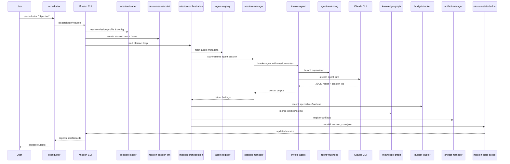

# Mission-Based Research Quick Start

## Overview

CConductor features **mission-based orchestration** - an autonomous, agentic approach to research that leverages Claude's reasoning capabilities to dynamically plan, execute, and adapt research strategies.

## Key Concepts

### Mission Profile
A JSON file defining:
- **Objective**: What you want to achieve
- **Success Criteria**: Required outputs and quality thresholds
- **Constraints**: Budget, time, and resource limits
- **Orchestration Guidance**: Strategic hints for the orchestrator

### Mission Orchestrator
An autonomous agent that:
- Plans research strategy
- Selects and invokes specialized agents
- Reflects on findings and adapts approach
- Manages budget and constraints
- Generates comprehensive reports

#### Mission Execution Loop (Visual)



### Agents
Specialized AI agents with defined capabilities:
- Discovered dynamically from project + user directories
- Selected based on capabilities needed
- Can be customized per user

## Quick Start

### Simple Method (Using Wrapper)

For most users, the convenient wrapper provides easy access to missions:

```bash
# Default general-research mission
./cconductor "your research question"

# Specify mission type
./cconductor "your question" --mission market-research
./cconductor "your question" --mission academic-research
./cconductor "your question" --mission competitive-analysis
./cconductor "your question" --mission technical-analysis

# With additional options
./cconductor "your question" --mission market-research --input-dir ~/data/ --non-interactive
```

### Advanced Method (Direct Access)

For advanced users who need more control:

### 1. List Available Missions

```bash
./src/cconductor-mission.sh missions list
```

Output:
```
Available missions (4):

Project missions:
  academic-research - Comprehensive academic literature review with peer-reviewed sources
  competitive-analysis - Comprehensive competitive landscape analysis with market positioning
  market-research - Market sizing and competitive landscape analysis with TAM/SAM/SOM calculations
  technical-analysis - Technical architecture and implementation analysis for software systems

User missions:
  (none)
```

### 2. Describe a Mission

```bash
./src/cconductor-mission.sh missions describe market-research
```

This shows:
- Mission objective
- Success criteria (required outputs, validations, thresholds)
- Constraints (time, budget, iterations)
- Preferred agents
- Orchestration guidance

### 3. Dry-Run (Preflight Check)

```bash
./src/cconductor-mission.sh dry-run \
  --mission market-research \
  --input-dir ~/data/acme-corp/
```

This validates:
- Mission exists and is valid
- Input directory exists and is accessible
- Required agents are available
- Shows what will happen

### 4. Execute Mission

```bash
./src/cconductor-mission.sh run \
  --mission market-research \
  --input-dir ~/data/acme-corp/
```

The orchestrator will:
1. Load mission profile
2. Initialize session and knowledge graph
3. Discover available agents
4. Form initial research plan
5. Invoke agents dynamically
6. Reflect after each agent invocation
7. Adapt strategy based on findings
8. Respect budget constraints
9. Generate final report

### 5. Review Results

Outputs in session directory:
- `report/mission-report.md` - Comprehensive mission report
- `logs/orchestration.jsonl` - Decision log with rationale
- `logs/events.jsonl` - Event stream
- `artifacts/manifest.json` - All artifacts produced
- `meta/session-manifest.json` - Canonical paths, agent manifest summaries, and artifact contract status
- `artifacts/<agent>/output.md` - Markdown digests emitted via the Write tool for every contract-bearing agent
- `knowledge/knowledge-graph.json` - Entities, claims, handoffs
- `meta/session.json` - Session metadata and budget tracking
- `viewer/dashboard-metrics.json` - Aggregated performance metrics (see `artifact_contract` block for manifest health)
- `work/<agent>/manifest.actual.json` - Per-agent artifact validation results (generated automatically; do not edit manually)

Use `jq '.artifact_contract' viewer/dashboard-metrics.json` to confirm that all required artifacts passed validation. If a manifest fails, inspect the corresponding `work/<agent>/manifest.actual.json` entry and re-run the agent with a refinement that targets the missing slot.

## Creating Custom Missions

### User Mission Directory

```bash
mkdir -p ~/.config/cconductor/missions/
```

### Example: Custom Mission

`~/.config/cconductor/missions/my-custom-research.json`:

```json
{
  "name": "my-custom-research",
  "description": "Custom research workflow for my specific needs",
  "version": "1.0",
  
  "objective": "Analyze X and produce Y with Z constraints",
  
  "success_criteria": {
    "required_outputs": ["research_report"],
    "confidence_threshold": 0.80,
    "all_claims_cited": true
  },
  
  "constraints": {
    "max_iterations": 5,
    "max_time_minutes": 30,
    "budget_usd": 5.0
  },
  
  "preferred_agents": [
    {"agent": "web-researcher", "for": "General web research"}
  ],
  
  "orchestration_guidance": "Focus on recent information. Cross-validate claims.",
  
  "output_specification": {
    "format": "markdown",
    "required_sections": ["summary", "findings", "recommendations"]
  }
}
```

### Run Your Custom Mission

```bash
./src/cconductor-mission.sh run --mission my-custom-research --input-dir ~/data/
```

## Creating Custom Agents

### User Agent Directory

```bash
mkdir -p ~/.config/cconductor/agents/my-agent/
```

### Agent Structure

```
~/.config/cconductor/agents/my-agent/
├── metadata.json       # Agent capabilities and configuration
└── system-prompt.md    # Agent instructions
```

### metadata.json

```json
{
  "name": "my-agent",
  "description": "Custom agent for specialized task",
  "capabilities": ["custom_capability"],
  "input_types": ["research_question"],
  "output_types": ["research_report"],
  "tools": ["WebSearch", "Read"],
  "model": "claude-sonnet-4-5"
}
```

### system-prompt.md

```markdown
# My Custom Agent

You are a specialized agent for [specific task].

## Your Role

[Define agent's purpose and responsibilities]

## Instructions

[Provide detailed instructions for the agent]

## Output Format

[Specify expected output format]
```

### Verify Agent Registration

```bash
./src/cconductor-mission.sh agents list
```

Your agent should appear in the "User agents" section.

## Advanced Usage

### Budget Override

```bash
./src/cconductor-mission.sh run \
  --mission market-research \
  --input-dir ~/data/ \
  --budget 10.0
```

### Time Limit Override

```bash
./src/cconductor-mission.sh run \
  --mission academic-research \
  --input-dir ~/papers/ \
  --max-time 60
```

### Invocation Limit

```bash
./src/cconductor-mission.sh run \
  --mission competitive-analysis \
  --input-dir ~/competitors/ \
  --max-invocations 15
```

## Understanding Orchestrator Decisions

### Decision Log

The orchestrator logs every major decision to `logs/orchestration.jsonl`:

```json
{
  "timestamp": "2025-10-09T23:00:00Z",
  "type": "agent_invocation",
  "decision": {
    "action": "invoke",
    "agent": "market-analyzer",
    "task": "Calculate TAM/SAM/SOM for SaaS market",
    "context": "Need independent market sizing validation",
    "expected_outputs": ["market_sizing_table"],
    "rationale": "Pitch deck claims seem inflated, need bottom-up calculation"
  }
}
```

### Viewing Decisions

```bash
# Pretty-print decisions
cat session/logs/orchestration.jsonl | jq '.'

# Filter by type
cat session/logs/orchestration.jsonl | jq 'select(.type == "agent_invocation")'

# Extract rationale
cat session/logs/orchestration.jsonl | jq -r '.decision.rationale'
```

## Mission Templates

### Academic Research
- **Objective**: Systematic literature review
- **Outputs**: literature_review, citation_network
- **Best For**: Research papers, academic analysis

### Market Research
- **Objective**: Market sizing and competitive analysis
- **Outputs**: market_sizing_table, competitive_analysis
- **Best For**: TAM/SAM/SOM, market landscape

### Competitive Analysis
- **Objective**: Competitive landscape assessment
- **Outputs**: competitive_analysis, research_report
- **Best For**: Competitor analysis, market positioning

### Technical Analysis
- **Objective**: Technical architecture assessment
- **Outputs**: technical_assessment, research_report
- **Best For**: Code review, architecture analysis

## Tips for Success

### 1. Clear Objectives
Write mission objectives as natural language goals:
- ✅ "Validate TAM/SAM/SOM claims and identify discrepancies"
- ❌ "Do market research"

### 2. Specific Outputs
List concrete deliverables:
- ✅ `["market_sizing_table", "competitive_analysis"]`
- ❌ `["report"]`

### 3. Reasonable Constraints
Set realistic limits based on task complexity:
- Simple research: 5 iterations, 20 minutes, $3
- Complex analysis: 10 iterations, 60 minutes, $15

### 4. Orchestration Guidance
Provide strategic hints without micromanaging:
- ✅ "Prioritize peer-reviewed sources. Flag wide variances."
- ❌ "First search Google, then read 3 papers, then..."

### 5. Monitor Budget
Check budget status during execution:
```bash
cat session/meta/budget.json | jq '.spent'
```

## Troubleshooting

### Mission Not Found
```
Error: Mission 'xyz' not found
```

**Solution**: Check mission name with `missions list`, or create in `~/.config/cconductor/missions/`

### Agent Not Available
```
Warning: Preferred agent 'xyz' not found
```

**Solution**: Orchestrator will select alternative. Check agent registry with `agents list`.

### Budget Exceeded
```
Warning: Budget limit exceeded
```

**Solution**: Increase budget with `--budget` flag or adjust mission constraints.

### Validation Failed
```
Error: Mission validation failed
```

**Solution**: Check mission JSON syntax and required fields. See `config/missions/README.md`.

## Next Steps

1. **Try Generic Missions**: Start with built-in templates
2. **Create Custom Missions**: Tailor to your workflows
3. **Build Custom Agents**: Add specialized capabilities
4. **Review Decision Logs**: Understand orchestrator reasoning
5. **Iterate and Refine**: Improve missions based on results

## Further Reading

- `config/missions/README.md` - Mission profile structure
- `docs/contributers/AGENT_METADATA_SCHEMA.md` - Agent metadata documentation
- `docs/contributers/EVENTS_CONTRACT.md` - Event system details
- `IMPLEMENTATION_SUMMARY.md` - Architecture overview
