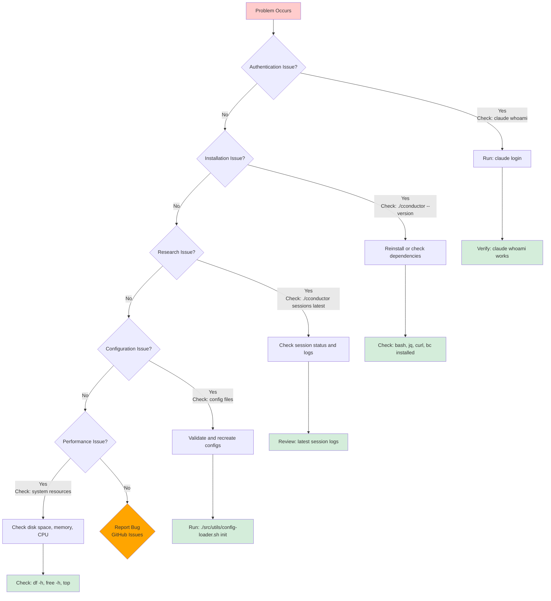

# CConductor Troubleshooting Guide

**Solve common issues and get research back on track**

**Last Updated**: October 2025  
**For**: All users

---

## Table of Contents

1. [Quick Diagnostics](#quick-diagnostics)
2. [Authentication Issues](#authentication-issues) ⭐ **Start Here**
3. [Installation & Setup Issues](#installation--setup-issues)
4. [Research Execution Problems](#research-execution-problems)
5. [Quality & Results Issues](#quality--results-issues)
6. [Performance Problems](#performance-problems)
7. [Security & Permissions](#security--permissions)
8. [Configuration Problems](#configuration-problems)
9. [Session & File Issues](#session--file-issues)
10. [Dashboard & Observability Issues](#dashboard--observability-issues)
11. [Hook Debugging](#hook-debugging)
12. [Getting Help](#getting-help)

---

## Quick Diagnostics

**Before diving into specific issues**, run these basic checks:

```bash
# 1. Check Claude Code authentication (MOST COMMON ISSUE)
claude whoami
# Should show your authenticated account
# If not: claude login

# 2. Check CConductor is installed correctly
./cconductor --version

# 2. Check for running research
ps aux | grep cconductor

# 3. Check disk space
df -h

# 4. Check recent sessions
./cconductor sessions

# 5. Check latest session status
./cconductor sessions latest

# 6. Check for errors in logs (use your OS-appropriate log path)
# macOS: tail -50 ~/Library/Logs/CConductor/research.log
# Linux: tail -50 ~/.local/state/cconductor/research.log

# 7. Check for lock files in your sessions directory
SESSION_DIR=$(./src/utils/path-resolver.sh resolve session_dir)
find "$SESSION_DIR" -name "*.lock"
```

**If any of these fail**, proceed to relevant section below.

### Troubleshooting Decision Tree



---

## Authentication Issues

### Invalid API Key / Not Authenticated

⭐ **This is the #1 most common issue for new users**

**Symptoms**:
- Research fails immediately with: `"Invalid API key · Please run /login"`
- Error: `Agent research-planner failed with code 1`
- Claude commands don't work

**Cause**: Claude Code CLI is not authenticated with your Claude.ai account.

**Solution**:

```bash
# Login to Claude Code (opens browser)
claude login

# Verify authentication
claude whoami
# Should show: "Logged in as: your@email.com"
```

**Requirements**:
- **Claude.ai account** with one of:
  - Claude Pro subscription ($20/month)
  - Claude Max subscription (enterprise)
  - Anthropic API key with credits

**Troubleshooting**:

1. **Browser doesn't open during login**:
   ```bash
   # Copy the URL manually and open in browser
   claude login --no-browser
   ```

2. **Already logged in but still getting errors**:
   ```bash
   # Logout and login again
   claude logout
   claude login
   ```

3. **Using API key instead of subscription**:
   ```bash
   # Set API key environment variable
   export ANTHROPIC_API_KEY="your-api-key"
   
   # Or add to your shell profile (~/.zshrc or ~/.bashrc)
   echo 'export ANTHROPIC_API_KEY="your-api-key"' >> ~/.zshrc
   ```

4. **Check your subscription status**:
   - Visit https://claude.ai/settings
   - Verify you have an active Pro/Max subscription
   - Or check API credits at https://console.anthropic.com/

**Note**: Free Claude.ai accounts do NOT have access to Claude Code CLI. You need a paid subscription or API credits.

---

## Installation & Setup Issues

### CConductor Command Not Found

**Symptoms**:

```bash
$ ./cconductor "question"
-bash: ./cconductor: No such file or directory
```

**Causes**:

- Not in the CConductor directory
- File was deleted or moved
- Wrong working directory

**Solutions**:

**1. Verify you're in the right directory**:

```bash
pwd
# Should show: /path/to/cconductor or /path/to/research-engine

ls -la cconductor
# Should show executable file
```

**2. If not in directory, navigate to it**:

```bash
cd /path/to/cconductor
./cconductor --version
```

**3. If file doesn't exist, check installation**:

```bash
# Check if git repository
git status

# If it's a git repo, check if cconductor exists
ls -la | grep cconductor

# If missing, restore from git
git checkout cconductor
chmod +x cconductor
```

**4. Set up path (optional)**:

```bash
# Add to ~/.bashrc or ~/.zshrc:
export PATH="/path/to/cconductor:$PATH"
alias cconductor="/path/to/cconductor/cconductor"

# Then:
source ~/.bashrc  # or ~/.zshrc
cconductor --version   # Should work from anywhere
```

---

### Claude Code CLI Not Found

**Symptoms**:

```bash
$ ./cconductor "question"
❌ Error: Claude Code CLI not found

CConductor requires Claude Code CLI to function.
```

**Cause**: Claude Code CLI is not installed, or Node.js/npm is missing.

**Solution**:

**1. Install Node.js first** (if not installed):

```bash
# Check if Node.js is installed
node --version

# If not installed:

# macOS
# First check if Homebrew is installed:
brew --version

# If Homebrew is not installed, install it first:
/bin/bash -c "$(curl -fsSL https://raw.githubusercontent.com/Homebrew/install/HEAD/install.sh)"

# Then install Node.js:
brew install node

# Ubuntu/Debian
curl -fsSL https://deb.nodesource.com/setup_20.x | sudo -E bash -
sudo apt-get install -y nodejs

# Verify
node --version  # Should be v18 or higher
npm --version   # npm comes with Node.js
```

**2. Install Claude Code CLI**:

```bash
npm install -g @anthropic-ai/claude-code
```

**3. Verify installation**:

```bash
claude --version
# Should show: claude-code/x.x.x
```

**4. If installation fails with permissions error**:

```bash
# Option 1: Use sudo (not recommended)
sudo npm install -g @anthropic-ai/claude-code

# Option 2: Fix npm permissions (better)
mkdir ~/.npm-global
npm config set prefix '~/.npm-global'
echo 'export PATH=~/.npm-global/bin:$PATH' >> ~/.zshrc
source ~/.zshrc
npm install -g @anthropic-ai/claude-code
```

**Requirements**:
- Node.js 18 or newer
- Claude.ai or Console account (Pro/Max subscription or API credits)

---

### Bash Version Error (macOS)

**Symptoms**:

```bash
$ ./cconductor "question"
Error: Bash 4.0 or higher is required for CLI parser
Current version: 3.2.57(1)-release

On macOS, install with: brew install bash
Then run with: /usr/local/bin/bash or /opt/homebrew/bin/bash
```

**Cause**: macOS ships with Bash 3.2 (from 2007) for licensing reasons, but CConductor requires Bash 4.0+ for associative arrays used in the CLI parser.

**Solutions**:

**1. Install Bash 4+ via Homebrew** (recommended):

```bash
brew install bash
```

**2. Run CConductor with the newer Bash**:

```bash
# Apple Silicon Mac
/opt/homebrew/bin/bash ./cconductor "what is quantum tunneling?"

# Intel Mac
/usr/local/bin/bash ./cconductor "what is quantum tunneling?"
```

**3. Create a permanent alias** (add to `~/.zshrc`):

```bash
alias cconductor='/opt/homebrew/bin/bash /path/to/cconductor/cconductor'
```

**4. Or update the shebang** in the `cconductor` script:

```bash
# Change first line from:
#!/usr/bin/env bash

# To (Apple Silicon):
#!/opt/homebrew/bin/bash

# Or (Intel):
#!/usr/local/bin/bash
```

**Verify installation**:

```bash
/opt/homebrew/bin/bash --version
# Should show: GNU bash, version 5.x or higher
```

---

### Permission Denied

**Symptoms**:

```bash
$ ./cconductor "question"
-bash: ./cconductor: Permission denied
```

**Cause**: File is not executable.

**Solution**:

```bash
chmod +x cconductor
chmod +x src/*.sh
chmod +x src/utils/*.sh
./cconductor --version  # Should work now
```

---

### Missing Dependencies

**Symptoms**:

- `jq: command not found`
- `curl: command not found`
- API errors

**Solutions**:

**Install jq**:

```bash
# macOS
# First check if Homebrew is installed:
brew --version
# If not: /bin/bash -c "$(curl -fsSL https://raw.githubusercontent.com/Homebrew/install/HEAD/install.sh)"

brew install jq

# Linux (Ubuntu/Debian)
sudo apt-get install jq

# Linux (Fedora/RHEL)
sudo dnf install jq

# Verify
jq --version
```

**Install curl** (usually pre-installed on macOS and most Linux):

```bash
# Check if already installed
curl --version

# macOS (if needed)
brew install curl

# Linux (if needed)
sudo apt-get install curl

# Verify
curl --version
```

**Set Claude API key**:

```bash
# Check if set
echo $ANTHROPIC_API_KEY

# If empty, set it
export ANTHROPIC_API_KEY="your-key-here"

# Make permanent (add to ~/.bashrc or ~/.zshrc)
echo 'export ANTHROPIC_API_KEY="your-key-here"' >> ~/.bashrc
source ~/.bashrc
```

---

## Research Execution Problems

### Research Starts But Immediately Fails

**Symptoms**:

- Research begins but errors out in first minute
- No output in session directory
- Error in logs

**Check logs first**:

```bash
tail -50 logs/research.log
# Look for error messages
```

**Common causes**:

**1. API Key Issues**:

```bash
# Check key is set
echo $ANTHROPIC_API_KEY

# Test API connection
curl https://api.anthropic.com/v1/messages \
  -H "x-api-key: $ANTHROPIC_API_KEY" \
  -H "anthropic-version: 2023-06-01" \
  -H "content-type: application/json" \
  -d '{"model":"claude-sonnet-4-5","max_tokens":10,"messages":[{"role":"user","content":"Hi"}]}'

# Should return a response, not an error
```

**2. Network Issues**:

```bash
# Test internet connection
ping -c 3 api.anthropic.com

# Test HTTPS
curl -I https://api.anthropic.com

# Check proxy settings if needed
echo $HTTP_PROXY
echo $HTTPS_PROXY
```

**3. Invalid Research Question**:

```bash
# Question too short or empty
./cconductor ""  # ❌ Will fail

# Solution: Provide meaningful question
./cconductor "What is CRISPR and how does it work?"  # ✅
```

---

### Research Hangs or Freezes

**Symptoms**:

- Research starts but makes no progress
- No new output for 5+ minutes
- Process is running but seemingly stuck

**Diagnosis**:

**1. Check if process is actually running**:

```bash
ps aux | grep cconductor
# Should show running process

# Check CPU usage
top -p $(pgrep -f cconductor)
# Should show some activity
```

**2. Check for network issues**:

```bash
# Monitor network activity
netstat -an | grep ESTABLISHED | grep 443

# Check if waiting on API
tail -f logs/research.log
# Should see activity
```

**Solutions**:

**If genuinely stuck**:

```bash
# Find PID
ps aux | grep cconductor

# Interrupt gracefully
kill -INT <PID>

# Wait 30 seconds, then force if needed
kill -9 <PID>

# Resume research
./cconductor sessions
./cconductor resume mission_id
```

**If waiting on slow API**:

- Be patient, especially for first few minutes
- Academic PDF fetching can be slow
- Large research topics take time (20-40 minutes normal)

**If repeatedly hanging**:

- Check network stability
- Try simpler question first
- Check API rate limits
- Increase timeout budget temporarily: `./cconductor --disable-agent-timeouts "question"`
  - Watchdog still monitors heartbeats; resume normal mode with `--enable-agent-timeouts`
- As a last resort, disable the watchdog (`--disable-watchdog`) to keep the run alive, but **stay at the terminal**; no automatic recovery will occur.
- Record any watchdog/timeout overrides in your runbook so teammates know the safeguards were relaxed.

---

### Session Locked Error

**Symptoms**:

```
❌ Research session is locked

Another research process is using this session, or a previous
session didn't exit cleanly.

Waited: 30 seconds
```

**Causes**:

- Another research is running on same session
- Previous research crashed
- Stale lock files

**Solutions**:

**Step 1: Check for active research**:

```bash
ps aux | grep cconductor-wrapper
ps aux | grep adaptive-research

# If found, check if it's legitimately running
tail -f logs/research.log
```

**Step 2: If process is stuck, kill it**:

```bash
# Get PID from ps output
kill <PID>

# If doesn't respond:
kill -9 <PID>
```

**Step 3: Remove stale locks**:

```bash
# Find locks
find research-sessions -name "*.lock"

# Remove all locks
find research-sessions -name "*.lock" -exec rm -rf {} +

# Or for specific session
rm -rf research-sessions/mission_*/knowledge/knowledge-graph.json.lock
rm -rf research-sessions/mission_*/task-queue.json.lock  # Legacy sessions only
```

**Step 4: Resume research**:

```bash
./cconductor resume mission_id
```

**Prevention**:

- Don't Ctrl+C during research
- Let research complete naturally
- Use `./cconductor status` before starting new research

---

### Can't Resume Session

**Symptoms**:

```bash
$ ./cconductor resume my-session
Error: Session not found
```

**Solutions**:

**1. List available sessions**:

```bash
./cconductor sessions
# Copy exact session name from output
```

**2. Check session directory exists**:

```bash
ls -la research-sessions/ | grep my-session
```

**3. If session exists but not listed**:

```bash
# Session might be corrupted
# Check for required files:
ls research-sessions/my-session/

# Should have:
# - work/ directory
# - intermediate/ directory
# - research-question.txt (in inputs/)
# - research-plan.json (in work/)
```

**4. If session is corrupted**:

```bash
# You may need to start fresh with similar question
./cconductor "original question again"
```

---

## Quality & Results Issues

### Low Quality Score

**Symptoms**:

- Quality score below 70
- Report says "NEEDS WORK" or "ACCEPTABLE"
- Missing citations or sources

**See**: [Quality Guide](QUALITY_GUIDE.md) for complete troubleshooting.

**Quick fixes**:

**1. Resume research** (most effective):

```bash
./cconductor resume mission_id
# Adds 10-15 points typically
```

**2. Ask more specific question**:

```bash
# Instead of:
./cconductor "AI trends"  # Too vague

# Try:
./cconductor "peer-reviewed research on large language model safety techniques 2023-2024"
```

**3. Provide PDF sources**:

```bash
mkdir -p pdfs/
cp your-papers/*.pdf pdfs/
./cconductor "question related to papers"
```

**4. Let research complete fully**:

- Don't interrupt early
- First 10 min: ~65 score
- 20 min: ~75 score  
- 30+ min: ~85+ score

---

### Missing or Poor Citations

**Symptoms**:

- Few or no citations in report
- Citation coverage below 70%
- No bibliography section

**See**: [Citations Guide](CITATIONS_GUIDE.md) for complete troubleshooting.

**Quick fixes**:

**1. Resume research**:

```bash
./cconductor resume mission_id
# Citations improve significantly
```

**2. Use academic keywords**:

```bash
./cconductor "peer-reviewed studies on [topic]"
./cconductor "published research on [topic]"
./cconductor "academic literature on [topic]"
```

**3. Configure for academic mode**:
Edit `config/cconductor-config.json`:

```json
{
  "research": {
    "min_source_credibility": "high",
    "min_sources_per_claim": 5
  }
}
```

**4. Provide academic PDFs**:

```bash
mkdir -p pdfs/
# Add PDFs of papers
./cconductor "question about these papers"
```

---

### Results Are Wrong or Outdated

**Symptoms**:

- Information is factually incorrect
- Data is from wrong year
- Contradicts known facts

**Causes**:

- Question wasn't specific enough
- Sources were outdated
- Low quality research

**Solutions**:

**1. Check source dates in report**:
Look at bibliography - when were sources published?

**2. Specify time frame in question**:

```bash
# Instead of:
./cconductor "market size for CRM software"

# Try:
./cconductor "market size for CRM software in 2024 based on recent reports"
```

**3. Resume research for more sources**:

```bash
./cconductor resume mission_id
# Gets additional verification
```

**4. Check quality score**:

```bash
./cconductor sessions latest
# Scroll to quality assessment
# If below 75, consider restarting with better question
```

**5. Provide authoritative sources**:
Add known good sources to `knowledge-base-custom/`:

```markdown
## Authoritative Sources
- Source 1: https://official-data.com
- Source 2: https://industry-report.com
```

---

### Research Doesn't Answer My Question

**Symptoms**:

- Report is about wrong topic
- Doesn't address what I asked
- Too general or too specific

**Causes**:

- Question was ambiguous
- Wrong research mode triggered
- Question was too broad or narrow

**Solutions**:

**1. Restart with clearer question**:

```bash
# Be more specific about what you want
./cconductor "What are the therapeutic mechanisms of action for CAR-T cell therapy in treating B-cell lymphomas?"

# Not:
./cconductor "CAR-T therapy"
```

**2. Check what mode was used**:

```bash
# Look in research-sessions/[session]/work/research-plan.json
jq '.mode' research-sessions/[session]/work/*/research-plan.json
```

**3. Specify domain in question**:

```bash
# For academic:
./cconductor "peer-reviewed research on [topic]"

# For market:
./cconductor "market size and competitive landscape for [product]"

# For technical:
./cconductor "technical architecture and implementation of [technology]"
```

---

## Performance Problems

### Research Is Very Slow

**Symptoms**:

- Taking hours for simple questions
- Much slower than expected
- Progress seems minimal

**Diagnosis**:

**1. Check what's happening**:

```bash
tail -f logs/research.log
# Should see activity
```

**2. Check if it's normal for your question**:

- Complex topics: 30-60 minutes normal
- Academic with many PDFs: 40-90 minutes
- Simple questions: 10-20 minutes
- Market research: 20-40 minutes

**3. Check network speed**:

```bash
# Test API latency
time curl -s -o /dev/null -w "%{time_total}\n" https://api.anthropic.com
# Should be < 1 second
```

**Solutions**:

**If too slow**:

**1. Check parallel execution**:
Edit `config/cconductor-config.json`:

```json
{
  "agents": {
    "parallel_execution": true,
    "max_parallel_agents": 4
  }
}
```

**2. Reduce depth for faster results**:

```json
{
  "research": {
    "max_web_searches": 3,
    "sources_per_search": 5,
    "min_sources_per_claim": 2
  }
}
```

**3. Simplify question**:

```bash
# Break complex question into parts
# Do multiple focused researches instead of one huge one
```

**4. Check system resources**:

```bash
# CPU
top

# Memory
free -h

# Disk I/O
iostat

# If system is overloaded, that's your bottleneck
```

---

### High API Costs

**Symptoms**:

- Unexpected high costs
- Using more tokens than expected

**Understanding costs**:

- Complex research: $2-10
- Simple research: $0.50-$2
- Academic (with PDFs): $5-15
- Very thorough research: $10-25

**Reduce costs**:

**1. Limit searches**:
Edit `config/cconductor-config.json`:

```json
{
  "research": {
    "max_web_searches": 3,
    "sources_per_search": 5
  }
}
```

**2. Reduce parallel agents**:

```json
{
  "agents": {
    "max_parallel_agents": 2
  }
}
```

**3. Disable expensive features**:

```json
{
  "research": {
    "include_code_analysis": false
  },
  "research_modes": {
    "scientific": {
      "track_citation_network": false
    }
  }
}
```

**4. Use shorter timeouts**:

```json
{
  "agents": {
    "agent_timeout_minutes": 5
  }
}
```

**5. Ask focused questions**:

- Specific questions cost less than broad ones
- Break big questions into smaller parts

---

## Security & Permissions

### Security Prompts Too Frequent

**Symptoms**:

- Constantly asked about domains
- Interrupts research flow
- Prompts for trusted sites

**Solution**: Switch security profile.

Edit `config/security-config.json`:

```json
{
  "security_profile": "permissive"
}
```

**Profiles**:

- `"strict"` (default): Maximum prompts, maximum safety
- `"permissive"`: Fewer prompts for trusted sites
- `"max_automation"`: Minimal prompts (VMs only!)

**See**: [Security Guide](SECURITY_GUIDE.md) for details.

---

### Can't Access Needed Sources

**Symptoms**:

- Research blocked from important domain
- Source is denied access
- "Security: blocked domain" in logs

**Solutions**:

**1. Check if domain is blocked**:

```bash
jq '.domain_lists.blocked' config/security-config.json
# See if your domain is listed
```

**2. Add domain to trusted list**:
Edit `config/security-config.json`:

```json
{
  "domain_lists": {
    "commercial": [
      "your-needed-domain.com"
    ]
  }
}
```

**3. Temporarily use permissive mode**:

```json
{
  "security_profile": "permissive"
}
```

**4. For academic domain, add to academic list**:

```json
{
  "domain_lists": {
    "academic": [
      "your-university.edu",
      "research-institute.org"
    ]
  }
}
```

---

### API Key Errors

**Symptoms**:

```
Error: API key not found
Error: Invalid API key
Error: Authentication failed
```

**Solutions**:

**1. Check key is set**:

```bash
echo $ANTHROPIC_API_KEY
# Should show your key
```

**2. If not set**:

```bash
export ANTHROPIC_API_KEY="sk-ant-..."

# Make permanent
echo 'export ANTHROPIC_API_KEY="sk-ant-..."' >> ~/.bashrc
source ~/.bashrc
```

**3. Verify key is valid**:

```bash
# Test API call
curl https://api.anthropic.com/v1/messages \
  -H "x-api-key: $ANTHROPIC_API_KEY" \
  -H "anthropic-version: 2023-06-01" \
  -H "content-type: application/json" \
  -d '{"model":"claude-sonnet-4-5","max_tokens":10,"messages":[{"role":"user","content":"test"}]}'
```

**4. Check for typos**:

- Key should start with `sk-ant-`
- No spaces before or after
- Complete key copied

**5. Generate new key if needed**:

- Go to console.anthropic.com
- API Keys section
- Generate new key
- Update `ANTHROPIC_API_KEY`

---

## Configuration Problems

### Config File Syntax Errors

**Symptoms**:

```
Error: Invalid JSON in config file
Error: Unexpected token in config
```

**Solutions**:

**1. Validate JSON syntax**:

```bash
jq empty config/cconductor-config.json
# No output = valid
# Error message = fix syntax
```

**2. Common JSON mistakes**:

```json
// ❌ Wrong:
{
  "option": "value",  // ← trailing comma
}

// ✅ Correct:
{
  "option": "value"
}

// ❌ Wrong:
{
  option: "value"  // ← unquoted key
}

// ✅ Correct:
{
  "option": "value"
}
```

**3. Reset to default**:

```bash
cp config/cconductor-config.default.json config/cconductor-config.json
# Start fresh with defaults
```

**4. Use JSON validator**:

- Copy config contents
- Paste into jsonlint.com
- Fix reported errors

---

### Configuration Not Taking Effect

**Symptoms**:

- Changed config but behavior unchanged
- Settings seem ignored
- Old behavior persists

**Solutions**:

**1. Verify you edited right file**:

```bash
# Should edit .json (NOT .default.json)
ls -la config/*.json

# Check your edits are there
jq . config/cconductor-config.json | grep "your-setting"
```

**2. Check for syntax errors**:

```bash
jq empty config/cconductor-config.json
```

**3. Restart any running research**:

```bash
# Changes only apply to new sessions
# Not to already-running research
```

**4. Check file permissions**:

```bash
ls -la config/cconductor-config.json
# Should be readable (-rw-r--r--)
```

**5. Check environment variable overrides**:

```bash
# These override config files
echo $CCONDUCTOR_SECURITY_PROFILE
echo $RESEARCH_MODE
echo $LOG_LEVEL

# Unset if needed
unset CCONDUCTOR_SECURITY_PROFILE
```

---

### Unknown Configuration Option

**Symptoms**:

- Warning about unknown config option
- Config option has no effect
- Documentation mentions option not in config

**Cause**: Option might be planned for v0.2 but not yet implemented.

**Check**: [Configuration Reference](CONFIGURATION_REFERENCE.md) for all v0.1 options.

**If option is missing**:

- Feature may be planned for a future release
- Use workaround if available
- Check GitHub issues or open a new one if critical

---

## Session & File Issues

### Can't Find Research Results

**Symptoms**:

- Completed research but can't find report
- Don't know where output went
- Lost session name

**Solutions**:

**1. Find latest session**:

```bash
./cconductor sessions latest
# Shows info about most recent research
```

**2. List all sessions**:

```bash
./cconductor sessions
# Shows all research sessions
```

**3. Find report file**:

```bash
# Report is always here:
ls research-sessions/*/report/mission-report.md

# Or for specific session:
cat research-sessions/mission_*/report/mission-report.md
```

**4. Check .latest marker**:

```bash
cat research-sessions/.latest
# Shows latest session ID

# View that report:
cat research-sessions/$(cat research-sessions/.latest)/report/mission-report.md
```

---

### Session Directory Is Huge

**Symptoms**:

- Session taking gigabytes of space
- Disk space warning
- Slow file operations

**Diagnosis**:

```bash
# Check session sizes
du -sh research-sessions/*

# Find largest sessions
du -sh research-sessions/* | sort -h | tail -5

# Check what's using space
du -sh research-sessions/mission_*/work
du -sh research-sessions/mission_*/cache
```

**Common causes**:

- Many large PDFs downloaded
- Extensive web fetches
- Long-running adaptive research

**Solutions**:

**1. Clean old sessions** (safe):

```bash
# Remove sessions older than 30 days
find research-sessions -name "mission_*" -type d -mtime +30 -exec rm -rf {} +
```

**2. Remove test/failed sessions** (safe):

```bash
# List sessions to identify test ones
./cconductor sessions

# Remove specific session
rm -rf research-sessions/test-session-name
```

**3. Archive old research** (safe):

```bash
# Create archive directory
mkdir -p research-sessions-archive

# Move old sessions
mv research-sessions/mission_old* research-sessions-archive/

# Or compress
tar -czf research-archive-$(date +%Y%m).tar.gz research-sessions/mission_old*
rm -rf research-sessions/mission_old*
```

**4. Limit raw data retention** (advanced):

```bash
# Keep only final reports, remove intermediate data
# WARNING: Can't resume these sessions afterward
for session in research-sessions/mission_*; do
  # Keep: report/mission-report.md, inputs/prompt.txt
  # Remove: work/, cache/ (large)
  rm -rf "$session/work"
  rm -rf "$session/intermediate"
done
```

---

### Corrupted Session Data

**Symptoms**:

```
Error: Invalid JSON in knowledge-graph.json
Error: Cannot read session data
jq parse error
```

**Diagnosis**:

```bash
# Check which file is corrupted
jq empty research-sessions/mission_*/knowledge/knowledge-graph.json
jq empty research-sessions/mission_*/meta/session.json

# Check file sizes (0 bytes = corrupted)
ls -lh research-sessions/mission_*/knowledge/*.json
ls -lh research-sessions/mission_*/meta/*.json
```

**Solutions**:

**If research is still running**:

1. Stop research (kill process)
2. Remove lock files
3. Restart research (will reinitialize)

**If research completed but files corrupted**:

1. Check if `report/mission-report.md` is intact:

   ```bash
   cat research-sessions/mission_*/report/mission-report.md
   ```

2. If report is good, you have your results (other files don't matter)
3. If report is corrupted, research must be restarted

**Prevention**:

- Don't force-kill research (use `kill`, not `kill -9`)
- Ensure adequate disk space
- Don't edit session files manually
- Let research complete naturally

---

## Dashboard & Observability Issues

### Dashboard Shows No Tool Activity

**Symptoms**:

- Dashboard loads but "Tool Activity" panel is empty
- No tool events in timeline
- logs/events.jsonl file is empty or missing

**Root Cause (Fixed in October 2025)**:

This was caused by Claude Code's inability to handle **spaces in file paths** for hooks. If your repository is in a path like `/Users/name/Library/Mobile Documents/...` (iCloud Drive), older versions had non-functional hooks.

**Solution**:

The fix has been implemented in `src/utils/setup-hooks.sh`. Hooks are now copied to each session directory and use relative paths.

**For New Sessions** (automatic):

```bash
# Just run research normally
./cconductor "your query"

# Hooks will work automatically
```

**For Existing Sessions** (manual fix):

```bash
# Option 1: Delete old sessions (clean slate)
rm -rf research-sessions/mission_*

# Option 2: Fix specific session
bash src/utils/setup-hooks.sh research-sessions/mission_XXXXX/
```

**Verify Hooks Are Working**:

```bash
# 1. Check session has hooks copied
ls -la research-sessions/mission_XXXXX/.claude/hooks/
# Should show: pre-tool-use.sh, post-tool-use.sh

# 2. Check settings.json uses relative paths
cat research-sessions/mission_XXXXX/.claude/settings.json | jq .hooks
# Should show: ".claude/hooks/pre-tool-use.sh" (relative path)

# 3. Run quick test
./cconductor "test query"
# You should see: 🔧 WebSearch: ...
#                  ✓ WebSearch (1.2s)

# 4. Check events logged
cat research-sessions/mission_*/logs/events.jsonl | head -5
# Should show tool_use_start and tool_use_complete events
```

---

### Viewer Links Return 404

**Symptoms**:

- Clicking `user-prompt.txt`, `mission-report.md`, or artifact links opens `http://localhost:<port>/filename` which 404s.
- Only the dashboard landing page loads; nested resources fail.

**Checklist**:

1. **Use the session-prefixed URL** — Every viewer asset now lives under `http://localhost:<port>/<session_id>/...`. For example: `http://localhost:8890/mission_123/report/mission-report.md`.
2. **Viewer running from session parent** — The server now serves the entire `research-sessions/` directory. If you opened an older dashboard, regenerate it: `./cconductor sessions viewer mission_123 --regenerate`.
3. **Check body data attribute** — Inspect the viewer with Developer Tools and confirm `<body data-session-id="mission_123">` is present. If missing, run `dashboard_generate_html` again.
4. **Confirm dashboard server is live** — Run `lsof -i :<port>` or re-launch via `./cconductor sessions viewer mission_123`.

If links still fail, note the URL being opened and include the `viewer/index.html` snippet when filing an issue.

---

### Events Not Logging to logs/events.jsonl

**Symptoms**:

- Research runs but logs/events.jsonl is empty
- Hooks don't appear to fire
- No real-time tool visibility

**Check 1: Hook Scripts Exist**:

```bash
# Session should have its own hooks
ls -la research-sessions/mission_XXXXX/.claude/hooks/

# If missing, session was created before fix
bash src/utils/setup-hooks.sh research-sessions/mission_XXXXX/
```

**Check 2: Permissions**:

```bash
# Hooks must be executable
ls -la research-sessions/mission_XXXXX/.claude/hooks/*.sh

# If not executable (should show: -rwxr-xr-x):
chmod +x research-sessions/mission_XXXXX/.claude/hooks/*.sh
```

**Check 3: Settings Configuration**:

```bash
# Check hooks configuration
cat research-sessions/mission_XXXXX/.claude/settings.json

# Should contain:
# {
#   "hooks": {
#     "PreToolUse": [...],
#     "PostToolUse": [...]
#   }
# }
```

**Check 4: Test Hooks Directly**:

```bash
cd research-sessions/mission_XXXXX/
export CCONDUCTOR_SESSION_DIR=$(pwd)

# Test pre-hook
echo '{"tool_name":"TestTool"}' | .claude/hooks/pre-tool-use.sh

# Should output: 🔧 PRE-HOOK: TestTool
# And create entry in logs/events.jsonl
```

---

### Dashboard Not Auto-Refreshing

**Symptoms**:

- Dashboard loads but doesn't update
- Shows stale data
- "Last updated" timestamp doesn't change

**Cause**:

JavaScript auto-refresh may be disabled or browser may be blocking it.

**Solution**:

```bash
# 1. Hard refresh browser
# Press: Cmd+Shift+R (Mac) or Ctrl+Shift+R (Windows/Linux)

# 2. Check browser console for errors
# Open DevTools (F12), check Console tab

# 3. Regenerate dashboard
./cconductor view-dashboard --regenerate

# 4. Verify metrics file exists
ls -lh research-sessions/mission_*/viewer/dashboard-metrics.json
```

---

### Real-Time Tool Visibility Not Working

**Symptoms**:

- No 🔧 or ✓ symbols during research
- Tools execute silently
- No feedback during agent execution

**This is expected behavior if**:

- Using `--quiet` flag
- Output redirected to file
- Running in background

**To get real-time visibility**:

```bash
# Run in foreground without --quiet
./cconductor "your query"

# You should see:
#   🔧 WebSearch: quantum computing
#     ✓ WebSearch (1.2s)
#   🔧 Read: paper.pdf
#     ✓ Read (0.3s)
```

**If still not working**:

```bash
# Check hooks are configured (see above sections)
# Verify stderr is not redirected
# Run from terminal, not IDE

# Test hooks work:
cd research-sessions/mission_XXXXX/
export CCONDUCTOR_SESSION_DIR=$(pwd)
claude --print --settings .claude/settings.json "list files" 2>&1 | grep "HOOK"
```

---

## Verbose Mode

Show detailed, user-friendly progress messages during research.

### What is Verbose Mode?

Verbose mode displays detailed progress information in plain language without the technical bash trace output of debug mode. It's perfect for:

- **Understanding what's happening** during research
- **Tracking progress** in long-running sessions
- **Seeing agent reasoning** and decisions in real-time
- **Following the research flow** without technical details

### Enabling Verbose Mode

```bash
# Using command-line flag
./cconductor "your research question" --verbose

# Using environment variable
export CCONDUCTOR_VERBOSE=1
./cconductor "your research question"

# Or inline for single run
CCONDUCTOR_VERBOSE=1 ./cconductor "your research question"

# Resume with verbose mode
./cconductor sessions resume mission_XXX --verbose
```

### What Verbose Mode Shows

1. **Agent activity in plain language**
   - "Starting web researcher" instead of "Invoking web-researcher with systemPrompt"
   - Clear task descriptions
   - Agent reasoning and decisions when available

2. **Tool use in friendly terms**
   - "🔍 Searching the web for: [query]" instead of "WebSearch: [query]"
   - "📄 Getting information from: [domain]" instead of "WebFetch: [url]"
   - "💾 Saving: [filename]" for research files

3. **Progress updates**
   - Research coordination steps
   - File operations (research files only)
   - Completion status with timing

4. **Agent reasoning** (when available)
   - Key insights discovered
   - Strategic decisions made
   - Research priorities

### Verbose Mode Output Example

```bash
$ ./cconductor "What is the SaaS market size?" --verbose
📢 Verbose mode enabled - showing detailed progress

🚀 Starting research coordinator
   Looking for: overall research strategy

🚦 Coordinating next research step...

🚀 Starting web researcher
   Looking for: SaaS market size data and trends

🔍 Searching the web for: "SaaS market size 2024"
✓ Done in 1.2s

📄 Getting information from: gartner.com
✓ Done in 2.3s

💾 Saving: findings-web-001.json

🧠 Research reasoning:
   - Found 3 authoritative sources on market sizing
   - Prioritizing recent data from analyst firms
   - Need additional data on growth trends

✓ Agent web-researcher completed successfully
```

### When to Use Verbose vs Debug

**Use Verbose Mode when:**
- You want to understand the research flow
- You're tracking progress on a complex query
- You want to see what agents are thinking
- You prefer user-friendly messages

**Use Debug Mode when:**
- You're troubleshooting technical issues
- You need to see exact bash commands
- You're debugging system errors
- You need complete execution traces

**Use both together** for maximum visibility:
```bash
CCONDUCTOR_DEBUG=1 CCONDUCTOR_VERBOSE=1 ./cconductor "query"
```

---

## Debug Mode

Enable technical logging for troubleshooting.

### Enabling Debug Mode

```bash
# Set environment variable
export CCONDUCTOR_DEBUG=1
./cconductor "research question"

# Or inline for single run
CCONDUCTOR_DEBUG=1 ./cconductor "research question"

# Resume with debug mode
CCONDUCTOR_DEBUG=1 ./cconductor resume mission_XXX
```

### What Debug Mode Does

1. **Enables bash trace mode** (`set -x`)
   - Shows every command as it executes
   - Displays variable expansions
   - Reveals execution flow

2. **Shows all errors immediately**
   - Removes `2>/dev/null` suppression
   - Prints errors to stderr in real-time
   - Includes timing information

3. **Logs everything to logs/system-errors.log**
   - All errors and warnings captured
   - Available for post-mortem analysis
   - Includes full context

### Debug Output Example

```bash
$ CCONDUCTOR_DEBUG=1 ./cconductor "test query"
🐛 Debug mode enabled
   All errors will be logged and displayed
   Check logs/system-errors.log in session directory for details

+ CCONDUCTOR_ROOT=/path/to/cconductor
+ source /path/to/cconductor/src/utils/cli-parser.sh
+ parse_cli_args test query
+ echo '→ Initializing session...'
→ Initializing session...
+ mkdir -p research-sessions/mission_1234567890
...
```

### Checking Error Log

After running with debug mode (or without), check the error log:

```bash
# View all errors
cat research-sessions/mission_XXX/logs/system-errors.log

# View recent errors (skip header comments)
tail -20 research-sessions/mission_XXX/logs/system-errors.log | grep -v '^#' | jq .

# Count errors by type
grep '"severity": "error"' research-sessions/mission_XXX/logs/system-errors.log | \
    jq -r '.operation' | sort | uniq -c

# Watch errors in real-time
tail -f research-sessions/mission_XXX/logs/system-errors.log | grep -v '^#' | jq .
```

### Common Debug Scenarios

**Scenario 1: Dashboard won't launch**

```bash
CCONDUCTOR_DEBUG=1 ./cconductor "test"
# Look for dashboard_launch errors in output
# Check logs/system-errors.log for details
```

**Scenario 2: Agent returning invalid JSON**

```bash
CCONDUCTOR_DEBUG=1 ./cconductor resume mission_XXX
# Trace shows agent invocation
# Error log shows JSON sample that failed
```

**Scenario 3: Silent failures**

```bash
# Without debug mode, some errors are suppressed
./cconductor "query"  # Fails silently

# With debug mode, all errors visible
CCONDUCTOR_DEBUG=1 ./cconductor "query"  # Shows what failed
```

### Performance Impact

Debug mode has minimal performance impact:
- Bash trace adds ~2-5% overhead
- Error logging is asynchronous
- No impact on Claude API calls

### Disabling Debug Mode

```bash
unset CCONDUCTOR_DEBUG
./cconductor "research question"
```

### See Also

- [Error Log Format](ERROR_LOG_FORMAT.md) - Error log structure and patterns
- [Dashboard Guide](DASHBOARD_GUIDE.md) - Dashboard shows error counts
- Configuration Reference - Configure error logging behavior

---

## Advanced Environment Toggles

Use these environment variables when automating runs or forcing diagnostic behaviors. CLI flags remain the preferred entry point; the env toggles primarily help in CI where you cannot easily reorder flags.

### Force Live Web Calls

```bash
# Disable both caches
CCONDUCTOR_DISABLE_WEB_FETCH_CACHE=1 CCONDUCTOR_DISABLE_WEB_SEARCH_CACHE=1 ./cconductor "query"

# Disable just the WebFetch cache (force re-downloads)
CCONDUCTOR_DISABLE_WEB_FETCH_CACHE=1 ./cconductor "query"

# Disable just the WebSearch cache (force new search sessions)
CCONDUCTOR_DISABLE_WEB_SEARCH_CACHE=1 ./cconductor "query"
```

Equivalent CLI flags exist (`--no-cache`, `--no-web-fetch-cache`, `--no-web-search-cache`), but the environment variables help when you want to set defaults for an entire shell session or CI job.

### Streaming & Event Tailer Diagnostics

- `CCONDUCTOR_ENABLE_STREAMING=0` — fall back to the non-streaming orchestrator if you suspect streaming regressions (defaults to enabled).
- `CCONDUCTOR_SKIP_EVENT_TAILER=1` — prevent the event tailer from attaching; isolates issues where event streaming interferes with automation output.
- `CCONDUCTOR_STREAM_DEBUG_LOG=/path/to/log` — capture raw streaming frames for post-mortem analysis. Leave unset during normal operation to avoid large logs.

Unset these variables after debugging so future runs return to the standard streaming experience.

---

## Hook Debugging

### What are Hooks?

Hooks are scripts that run automatically before and after each tool use (web search, file read, etc.) to:
- Log tool activity to `logs/events.jsonl`
- Display real-time tool messages in verbose mode
- Track cache usage and performance

### When to Check Hook Debug Logs

Check hook debug logs if you experience:
- Missing tool messages in verbose mode
- No events appearing in `logs/events.jsonl`
- Tool tracking not working
- Cache behavior issues
- Hook-related errors

### Viewing Hook Debug Logs

Hook debug information is automatically logged to:

```bash
research-sessions/mission_XXX/logs/hook-debug.log
```

**To view hook debug log:**

```bash
# View entire log
cat research-sessions/mission_*/logs/hook-debug.log

# Watch in real-time
tail -f research-sessions/mission_*/logs/hook-debug.log

# Search for specific issues
grep "error\|fail\|session_dir" research-sessions/mission_*/logs/hook-debug.log
```

### What Hook Debug Logs Show

The debug log includes:
- Hook invocation timestamps
- Tool names and agents being invoked
- Session directory detection
- Project root resolution
- Library directory detection
- Event logging attempts
- Lock acquisition status

### Common Hook Issues

**Issue: Hook debug log is empty or missing**

This usually means:
- Session hasn't started any tool usage yet
- Hooks aren't being called by Claude Code (rare)
- Session directory wasn't properly detected

**Solution:**
```bash
# Check if logs/events.jsonl is being populated
ls -lh research-sessions/mission_*/logs/events.jsonl

# If logs/events.jsonl exists but hook-debug.log doesn't, hooks may be failing silently
# Check for any session-level errors
ls -la research-sessions/mission_*/logs/
```

**Issue: "session_dir unbound variable" error**

Fixed in v0.4.0. Update cconductor if you see this.

**Issue: Events logging to wrong location**

Fixed in v0.4.0. All events now log to `logs/events.jsonl`.

### Hook Architecture

Hooks write to multiple locations:
- `logs/events.jsonl` - Structured event log (main output)
- `logs/hook-debug.log` - Diagnostic information
- `logs/.events.lock` - Lock file for atomic writes

The event-tailer process reads `logs/events.jsonl` and displays tool activity in your terminal in verbose mode.

### See Also

- [Events Contract](EVENTS_CONTRACT.md) - Event structure and types
- [Dashboard Guide](DASHBOARD_GUIDE.md) - Dashboard reads from logs/events.jsonl
- Verbose Mode (above) - See tool messages in real-time

---

## Getting Help

### Collecting Diagnostic Information

**Before asking for help**, collect this info:

```bash
# 1. Version
./cconductor --version

# 2. System info
uname -a
bash --version
jq --version

# 3. Recent logs
tail -100 logs/research.log > problem-logs.txt

# 4. Session info (if relevant)
./cconductor sessions > sessions-info.txt

# 5. Config (remove sensitive data!)
jq 'del(.advanced.mcp_servers)' config/cconductor-config.json > config-sanitized.json

# 6. Error message (exact text)
```

### Where to Get Help

**1. Documentation**:

- [User Guide](USER_GUIDE.md) - Complete usage
- [Quick Reference](QUICK_REFERENCE.md) - Command cheat sheet
- [Configuration Reference](CONFIGURATION_REFERENCE.md) - All settings

**2. Guides**:

- [Quality Guide](QUALITY_GUIDE.md) - Quality troubleshooting
- [Citations Guide](CITATIONS_GUIDE.md) - Citation issues
- [Security Guide](SECURITY_GUIDE.md) - Security configuration
- [Custom Knowledge](CUSTOM_KNOWLEDGE.md) - Knowledge base issues

**3. Logs**:

```bash
# Research log
tail -100 logs/research.log

# System errors
dmesg | tail

# CConductor-specific errors
grep ERROR logs/*.log
```

**4. Community** (if available):

- GitHub Issues (if open source)
- Community forum
- Discord/Slack

---

## Quick Reference

### Essential Commands

```bash
# Start research
./cconductor "research question"

# Check status
./cconductor status

# List sessions
./cconductor sessions

# Get latest session
./cconductor sessions latest

# Resume research
./cconductor resume mission_id

# Check version
./cconductor --version

# Get help
./cconductor --help
```

### Essential File Locations

```bash
# Configuration
config/cconductor-config.json
config/security-config.json
config/cconductor-modes.json

# Session data
research-sessions/[session-name]/report/mission-report.md

# Logs
logs/research.log

# Custom knowledge
knowledge-base-custom/

# PDFs for analysis
pdfs/
```

### Essential Checks

```bash
# API key set?
echo $ANTHROPIC_API_KEY

# Config valid?
jq empty config/cconductor-config.json

# Disk space?
df -h

# Any locks?
find research-sessions -name "*.lock"

# Research running?
ps aux | grep cconductor

# Recent errors?
grep ERROR logs/research.log | tail -10
```

---

**Last Updated**: October 2025

**For more help**, see [User Guide](USER_GUIDE.md) or visit the documentation.

---

**CConductor Troubleshooting** - Get back on track 🔧
