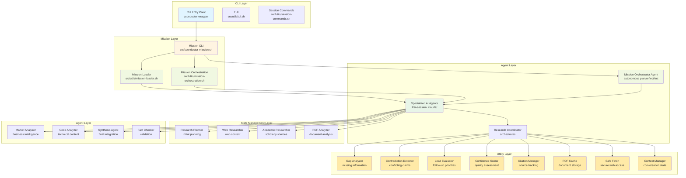

# System Patterns: CConductor

**NOTE**: This document describes the v0.2.0 architecture with mission-based orchestration. The v0.1.x task-queue system has been completely replaced.

## System Architecture

### Key Architectural Changes in v0.2.0

**What Changed**:
- **Removed**: Task-queue system (`src/task-queue.sh`), research-coordinator agent, cconductor-adaptive.sh
- **Added**: Mission system, mission orchestrator agent, agent registry, budget tracking, artifact management
- **Philosophy**: Shift from rigid task queue to autonomous, LLM-driven orchestration

**Why**:
- Enable true agent autonomy with plan/reflect/act cycle
- Support capability-based agent selection (more flexible than hardcoded coordinator)
- Provide better budget control and observability
- Improve artifact provenance and reproducibility

### High-Level Architecture (v0.2.0)



**Legend**:
- **Blue**: Entry points and user interaction
- **Yellow**: Core orchestration and control flow
- **Green**: State management and data structures
- **Dark Green**: AI agent execution layer
- **Orange**: Utility functions and supporting services

### Core Components

#### 1. Adaptive Research Engine (`src/cconductor-adaptive.sh`)

- **Role**: Main orchestrator
- **Responsibilities**:
  - Initialize research session
  - Load configuration and knowledge
  - Execute research iterations
  - Monitor confidence and termination conditions
  - Coordinate agent execution
- **Pattern**: Event-driven coordinator with feedback loop

#### 2. Knowledge Graph (`src/knowledge-graph.sh`)

- **Role**: Shared state manager
- **Responsibilities**:
  - Track discovered entities and relationships
  - Store claims with confidence scores
  - Maintain gaps and contradictions
  - Provide query interface for research state
- **Pattern**: Central state store with concurrent access control
- **Data Structure**: JSON with nested entities, claims, relationships

#### 3. Task Queue (`src/task-queue.sh`)

- **Role**: Dynamic task manager
- **Responsibilities**:
  - Maintain priority queue of research tasks
  - Support task addition during research
  - Track task status (pending/running/complete)
  - Prevent duplicate tasks
- **Pattern**: Priority queue with state machine
- **Thread Safety**: File-based locking for concurrent access

#### 4. Shared State Manager (`src/shared-state.sh`)

- **Role**: Concurrency control
- **Responsibilities**:
  - Provide atomic read/write operations
  - File-based locking for multi-process access
  - Lock timeout and cleanup
  - Prevent race conditions
- **Pattern**: Advisory file locking with timeout
- **Implementation**: Uses `flock` for exclusive access

## Key Technical Decisions

### 1. File-Based State Management

**Decision**: Use JSON files for state storage instead of database

**Rationale**:

- Simplicity: No external database dependency
- Portability: Works across all platforms
- Debuggability: Human-readable state
- Git-friendly: Sessions can be version controlled

**Trade-offs**:

- Performance limits with very large knowledge graphs (>1000 entities)
- Requires careful concurrency control
- Not optimal for multi-machine scenarios

**Mitigation**:

- File locking for thread safety
- Atomic write operations
- Efficient JSON parsing with jq

### 2. Multi-Agent via Claude Code CLI

**Decision**: Use Claude Code CLI tool for agent orchestration

**What is Claude Code**: Standalone CLI tool (`npm install -g @anthropic-ai/claude-code`) that provides a complete runtime environment for AI agents. Not an IDE extension - it's a command-line tool that runs from the terminal.

**Rationale**:

- **Complete Runtime**: Provides Task tool with file system access, command execution, and structured I/O
- **Agent Definition**: Agent templates in `src/claude-runtime/agents/*.json`, copied per-session for isolation
- **Session Isolation**: Each research session has its own `.claude/` directory with agent definitions
- **JSON Communication**: Structured input/output for reliable agent coordination
- **Parallel Execution**: Multiple agents can run concurrently
- **Session Management**: Built-in context preservation and state management
- **Security Boundaries**: Sandboxing and error handling built-in
- **MCP Integration**: Each session can have custom `.mcp.json` for Model Context Protocol servers

**Trade-offs**:

- Requires Claude Code CLI installation (cannot use just Anthropic API key)
- Requires Claude.ai or Console account with Pro/Max subscription or API credits
- Requires Node.js 18+ for Claude Code installation
- Limited to Claude's context window per agent
- API usage per agent invocation

**Benefits**:

- Specialized agents for different domains with file/command access
- Clean separation of concerns
- Easy to add new agent types
- Professional tooling with established patterns
- MCP integration for extended functionality

**How CConductor Uses It**:

```bash
# CConductor invokes Claude Code CLI from session CWD
# Each session has its own .claude/ directory

# Agent templates (source)
src/claude-runtime/agents/research-coordinator.json
src/claude-runtime/agents/web-researcher.json
src/claude-runtime/agents/academic-researcher.json
# ... 11 agents total

# Session-specific agents (copied from template)
$session_dir/.claude/agents/research-coordinator.json
$session_dir/.claude/agents/web-researcher.json
# ... all agents copied per-session

# Session MCP configuration
$session_dir/.mcp.json  # Local scope for Claude Code
```

### 3. Bash as Implementation Language

**Decision**: Implement core system in Bash scripts

**Rationale**:

- Universal availability (macOS, Linux, Windows WSL)
- No compilation required
- Native integration with CLI tools (jq, curl)
- Easy to inspect and debug

**Trade-offs**:

- Bash can be error-prone
- Limited data structures
- String manipulation heavy

**Mitigation**:

- Comprehensive shellcheck validation
- Defensive programming practices
- Well-defined function boundaries
- Extensive error handling

### 4. Adaptive Research Pattern

**Decision**: Dynamic task generation vs. fixed workflow

**Rationale**:

- Research is exploratory by nature
- Can't predict all needed information upfront
- Quality improves with iteration
- Mirrors human research process

**Implementation**:

- Coordinator agent analyzes findings after each iteration
- Gap analyzer identifies missing information
- Lead evaluator prioritizes follow-up tasks
- Continues until confidence threshold met

### 5. JSON for Inter-Agent Communication

**Decision**: Standardized JSON format for all agent outputs

**Rationale**:

- Machine-readable and parseable
- Type-safe with schemas
- Easy to validate and transform
- Supports complex nested data

**Format**:

```json
{
  "entities_discovered": [...],
  "claims": [{
    "text": "...",
    "confidence": 0.9,
    "citations": [...]
  }],
  "relationships_discovered": [...],
  "gaps_identified": [...],
  "suggested_follow_ups": [...]
}
```

## Design Patterns

### Pattern 1: Mission-Based Orchestration (v0.2.0)

**Problem**: Static task queues are rigid and require extensive hardcoding for different research scenarios

**Solution**: Autonomous mission orchestrator with plan/reflect/act cycle

```
Mission Profile (JSON)
    ↓
Mission Orchestrator Agent
    ↓
Plan: Analyze mission + form strategy
    ↓
Select Agent: Query registry by capabilities
    ↓
Invoke Agent: Execute with inputs
    ↓
Reflect: Analyze results + knowledge graph
    ↓
Adapt: Update strategy or early exit
    ↓
[Loop until mission complete or budget exceeded]
    ↓
Generate Report
```

**Implementation**:

- Mission profiles define objectives, success criteria, constraints
- Orchestrator agent uses LLM reasoning for dynamic planning
- Agent registry enables capability-based selection
- Budget tracker enforces multi-dimensional limits
- Artifact manager ensures provenance
- Decision logging provides observability

**Benefits**:

- True autonomy (orchestrator makes intelligent decisions)
- Flexible (works for any mission type)
- Observable (decision logs show reasoning)
- Controllable (budget limits prevent runaway)
- Extensible (add new agents/missions without code changes)

### Pattern 2: Feedback Loop (Adaptive Research - v0.1.x pattern, deprecated)

**Problem**: Static research plans miss emergent information

**Solution**: Iterative feedback loop with analysis

```
Execute Tasks → Analyze Results → Identify Gaps/Leads
      ↑                                    ↓
      └──────── Generate New Tasks ────────┘
```

**Implementation**:

- Task queue holds pending tasks
- After each iteration, coordinator analyzes findings
- Gap analyzer, contradiction detector, lead evaluator run
- New high-priority tasks added to queue
- Loop continues until confidence threshold met

### Pattern 2: Specialized Agents (Strategy Pattern)

**Problem**: Different sources require different research approaches

**Solution**: Specialized agents for each domain

**Agents**:

- `web-researcher`: Web search and scraping
- `academic-researcher`: Academic database queries
- `pdf-analyzer`: PDF extraction and analysis
- `market-analyzer`: Business intelligence focus
- `code-analyzer`: Technical documentation and code
- `prompt-parser`: Separates research objectives from format specifications
- `synthesis-agent`: Consolidates findings into final reports
- `fact-checker`: Validates claims and data quality

**Benefits**:

- Domain expertise per agent
- Parallel execution possible
- Easy to add new agent types
- Clear responsibility boundaries

### Pattern 3: Shared State (Central Store)

**Problem**: Multiple agents need access to research state

**Solution**: Centralized knowledge graph with controlled access

**Implementation**:

- Single JSON file per session
- File locking for concurrent access
- Atomic updates via temp files
- Version tracking for conflict detection

**Access Pattern**:

```bash
# Read current state
knowledge=$(read_knowledge_graph "$session_id")

# Update with new findings
update_knowledge_graph "$session_id" "$new_data"

# Query specific information
entities=$(query_knowledge_graph "$session_id" "entities")
```

### Pattern 4: Priority Queue (Task Management)

**Problem**: Need to execute most important tasks first

**Solution**: Priority-based task queue

**Priority Levels**:

- 10: Critical (contradictions to resolve)
- 7-9: High priority (important gaps)
- 4-6: Medium priority (worthwhile leads)
- 1-3: Low priority (nice-to-have information)

**Implementation**:

- Tasks stored with metadata (priority, status, dependencies)
- Queue sorts by priority on each access
- Deduplication prevents redundant tasks
- Status tracking: pending → running → complete

### Pattern 5: Prompt Separation (Clean Objectives)

**Problem**: User prompts often mix research objectives with output formatting instructions, which can:
- Pollute the knowledge graph with format-specific text
- Cause JSON corruption when special characters aren't escaped
- Confuse research agents about their actual task
- Make it hard to apply different formats to the same research

**Solution**: Separate research objectives from format specifications using a dedicated prompt-parser agent

**Implementation** (Added October 2025):

1. **At Mission Start**: Orchestrator invokes `prompt-parser` agent as first step
2. **Parser Agent** (Claude Sonnet 4):
   - Reads user's full prompt
   - Extracts clean research objective (what to research)
   - Extracts output specification (how to format results)
   - Preserves full original prompt for reference
3. **Updates**:
   - `session.json`: Stores all three components
   - `knowledge-graph.json`: Stores only clean objective
4. **Agent Usage**:
   - Research agents receive clean objective only
   - Synthesis agent receives format specification
   - Dashboard displays both appropriately

**Benefits**:

- **Prevents KG corruption**: Clean objectives avoid JSON special characters
- **Clear separation of concerns**: Research vs. presentation
- **Flexible formatting**: Same research, multiple output formats
- **Better agent focus**: Research agents see only their task

**Example**:

```json
// Input (user prompt):
"Research SSRIs for depression. Format: Classification → Evidence → Studies"

// Parser Output:
{
  "objective": "Research SSRIs for depression",
  "output_specification": "Format: Classification → Evidence → Studies",
  "research_question": "Research SSRIs for depression. Format: ..."
}
```

**Files**:
- Agent: `src/claude-runtime/agents/prompt-parser/`
- Handler: `src/utils/prompt-parser-handler.sh`
- Integration: `src/utils/mission-orchestration.sh`

### Pattern 7: Defensive Validation (Error Handling)

**Problem**: External data and commands can fail

**Solution**: Comprehensive validation and error recovery

**Layers**:

1. Input validation (all parameters)
2. Precondition checks (file exists, valid format)
3. Operation execution with error capture
4. Postcondition validation (result makes sense)
5. Cleanup on failure
6. User-friendly error messages

**Example**:

```bash
function safe_operation() {
    # Input validation
    [[ -z "$1" ]] && error "Parameter required"
    
    # Precondition
    [[ -f "$file" ]] || error "File not found: $file"
    
    # Operation with error capture
    result=$(command 2>&1) || {
        error "Command failed: $result"
        cleanup
        return 1
    }
    
    # Postcondition
    [[ -n "$result" ]] || error "Empty result"
    
    echo "$result"
}
```

## Component Relationships

### Research Session Lifecycle

```
1. Initialization
   ├─ Create session directory
   ├─ Initialize knowledge graph
   ├─ Load configuration
   ├─ Load custom knowledge
   └─ Generate initial tasks

2. Research Loop (Adaptive)
   ├─ Get next task from queue
   ├─ Execute with appropriate agent
   ├─ Update knowledge graph
   ├─ Run analyzers (gaps/contradictions/leads)
   ├─ Generate follow-up tasks
   ├─ Calculate confidence score
   └─ Check termination conditions

3. Synthesis
   ├─ Aggregate all findings
   ├─ Resolve remaining contradictions
   ├─ Generate bibliography
   ├─ Calculate final quality score
   └─ Format output

4. Output
   ├─ Generate markdown report
   ├─ Optionally generate HTML/JSON
   ├─ Save session metadata
   └─ Update session index
```

### Data Flow

```
User Query
    ↓
Configuration + Knowledge Base
    ↓
Initial Research Tasks
    ↓
[Research Loop]
    Agent Execution → Findings (JSON)
         ↓
    Knowledge Graph Update
         ↓
    Analysis (Gaps/Contradictions/Leads)
         ↓
    New Task Generation
         ↓
    [Loop until confident]
    ↓
Final Synthesis
    ↓
Formatted Output (MD/HTML/JSON)
```

## Concurrency Model

### Multi-Process Architecture

**Capability**: Multiple agents can run in parallel

**Implementation**:

- Each agent runs as separate process
- Shared state via knowledge graph
- File locking for atomic updates
- Task queue prevents duplicate work

**Synchronization Points**:

- Knowledge graph updates (locked)
- Task queue modifications (locked)
- Session state changes (locked)
- File system operations (atomic)

### Lock Management

**Pattern**: Advisory file locks with timeout

```bash
# Acquire lock
exec 200>"/path/to/lockfile"
flock -w 30 200 || error "Lock timeout"

# Critical section (exclusive access)
modify_shared_state

# Release lock
flock -u 200
```

**Features**:

- 30-second timeout prevents deadlock
- Automatic cleanup on process exit
- Supports both exclusive and shared locks
- Works across all platforms

## Security Architecture

### Defense in Depth

**Layer 1: Domain Control**

- Configurable security profiles (strict/permissive/max_automation)
- Domain allowlists per profile
- User approval for unknown domains

**Layer 2: Content Validation**

- File type verification
- Size limits (PDFs max 100MB)
- Format validation (JSON schema checks)
- Malformed data rejection

**Layer 3: Execution Safety**

- No arbitrary code execution from external sources
- Sandboxed command execution
- Input sanitization
- Path traversal prevention

**Layer 4: Audit Trail**

- All external access logged
- Source tracking per claim
- Decision logging
- User approval history

## Performance Optimizations

### 1. PDF Caching

- **Strategy**: SHA-256 hash-based deduplication
- **Benefit**: Avoid re-downloading same PDFs
- **Implementation**: Cache at OS-appropriate location
- **Thread Safety**: File locking prevents corruption

### 2. Parallel Agent Execution

- **Strategy**: Multiple agents run concurrently
- **Benefit**: 2-4x faster for multi-source research
- **Limitation**: Bounded by Claude Code rate limits

### 3. Knowledge Graph Indexing

- **Strategy**: In-memory indexes for frequent queries
- **Benefit**: O(1) lookup for entities by ID
- **Trade-off**: Memory overhead for large graphs

### 4. Lazy Loading

- **Strategy**: Load configuration only when needed
- **Benefit**: Faster startup for simple commands
- **Implementation**: Config loaded on first access

## Testing Strategy

### Current State

- Manual testing for v0.1.0
- Basic shellcheck validation
- Example test scripts in `tests/`

### Planned Testing

1. **Unit Tests**: Test individual functions
2. **Integration Tests**: Test component interactions
3. **End-to-End Tests**: Full research sessions
4. **Performance Tests**: Benchmark operations
5. **Concurrent Tests**: Multi-process scenarios

## Code Organization

### Directory Structure

```
src/
├── cconductor-adaptive.sh       # Main orchestrator
├── knowledge-graph.sh      # State management
├── task-queue.sh           # Task management
├── shared-state.sh         # Concurrency control
├── init.sh                 # Initialization
├── claude-runtime/         # Claude Code integration
│   ├── agents/            # 11 specialized agent definitions
│   │   ├── academic-researcher/
│   │   ├── code-analyzer/
│   │   ├── research-coordinator/
│   │   └── ... (8 more)
│   ├── hooks/             # Research logging hooks
│   ├── mcp.json           # MCP server configuration
│   └── settings.json      # Claude Code settings
├── utils/                  # Utility functions (30+ files)
│   ├── gap-analyzer.sh
│   ├── contradiction-detector.sh
│   ├── lead-evaluator.sh
│   ├── confidence-scorer.sh
│   ├── citation-manager.sh
│   ├── pdf-cache.sh
│   ├── safe-fetch.sh
│   └── ... (others)
└── templates/              # UI templates
    ├── dashboard-template.html
    └── dashboard.js
```

### Naming Conventions

- **Files**: kebab-case (e.g., `gap-analyzer.sh`)
- **Functions**: snake_case (e.g., `analyze_gaps`)
- **Variables**: snake_case (e.g., `session_id`)
- **Constants**: UPPER_CASE (e.g., `MAX_ITERATIONS`)
- **Globals**: Prefixed with module name (e.g., `KG_ENTITIES`)

### Function Design Principles

1. **Single Responsibility**: Each function does one thing
2. **Pure When Possible**: Avoid side effects when practical
3. **Error Returns**: Return non-zero on failure
4. **Parameter Validation**: Check all inputs
5. **Documentation**: Clear comments for complex logic

## Evolution and Extensibility

### Adding New Agents

1. Create agent JSON template in `src/claude-runtime/agents/`
2. Define input/output schema
3. Implement adaptive output format
4. Template will be automatically copied to all new research sessions
5. Register in orchestrator
6. Add tests

### Adding New Modes

1. Define mode in `config/cconductor-modes.default.json`
2. Specify agent preferences
3. Configure parameters
4. Document in user guide
5. Test with representative queries

### Extending Knowledge Base

1. Add markdown files to `knowledge-base-custom/`
2. Follow format: overview, concepts, facts
3. System auto-discovers on startup
4. No code changes required

## Critical Learnings: Hooks, Event Tailer & Verbose Mode

### Hook Output & Claude Code Behavior (CRITICAL)

**Key Discovery**: Claude Code **captures hook stderr** when hooks are configured as `type: "command"` in `.claude/settings.json`. This is a fundamental constraint that shapes the entire verbose mode architecture.

**What This Means**:
- Hooks can write to `events.jsonl` ✅
- Hooks CANNOT write to terminal stderr directly ❌ (captured by Claude Code)
- Hooks run in Claude Code's subprocess context, isolated from main shell
- `exit 2` from `PreToolUse` aborts the tool and Claude shows hook stderr to the model (used by LibraryMemory guard)
- Cache-aware WebSearch/WebFetch guidance now lives in a shared skill copied into each session (`.claude/skills/cache-aware-web-research/`); hooks still enforce caching but prompts defer to the skill for consistent reasoning
- WebFetch execution happens on Anthropic's servers; blocking it in hooks prevents the network call entirely
- Per-session `hook-debug.log` is essential for diagnosing hook behavior (written alongside `events.jsonl`)

**Implications**:
- Direct `echo ... >&2` in hooks won't appear in terminal
- This is why we initially saw tool calls in the journal viewer but NOT in the terminal
- This is NOT a bug—it's Claude Code's design for subprocess isolation

### Event Tailer Architecture (CRITICAL)

**Why We Need It**:
The event tailer is **not optional**—it's the **only way** to display real-time tool activity to users because:

1. Hooks write to `events.jsonl` (only reliable output path)
2. Claude Code captures hook stderr (doesn't reach terminal)
3. Tailer runs in main shell context (stderr reaches terminal)
4. Tailer provides the bridge from Claude Code's isolated context to user terminal

**How It Works**:
```bash
Hook (Claude Code subprocess)
  → writes to events.jsonl
  → stderr captured by Claude Code ❌
  
Event Tailer (main shell background process)
  → tail -f events.jsonl
  → echo to stderr ✅
  → stderr reaches user terminal ✅
```

**Duplicate Prevention**:
- **Problem**: Multiple agents (orchestrator + delegated) would each start tailers
- **Solution**: Environment variable `CCONDUCTOR_EVENT_TAILER_RUNNING=1`
- **Why Not PID File**: Race condition—both agents check before either writes
- **Why Env Var Works**: Set in parent shell before delegated agent spawns

**Implementation Pattern**:
```bash
# Check if already running in this shell session
if [[ -n "${CCONDUCTOR_EVENT_TAILER_RUNNING:-}" ]]; then
    return 0  # Already running, don't start another
fi

# Start background tailer with inline logic (no function exports)
(tail -f events.jsonl | while read line; do
    # Parse and display inline
    # No exported functions needed
done) &

# Mark as running
export CCONDUCTOR_EVENT_TAILER_RUNNING=1
```

**Critical: Self-Contained Tailer**:
- All display logic MUST be inline in the background subshell
- CANNOT use `export -f` to export functions (causes hangs/blocks)
- Parse JSON, format messages, and acquire locks ALL within the `while read` loop

### Verbose Mode Architecture

**Two-Mode System**:
1. **Verbose Mode** (`--verbose` / `CCONDUCTOR_VERBOSE=1`):
   - Tailer shows detailed, friendly messages
   - Example: `🔍 Searching the web for: water composition`
   
2. **Non-Verbose Mode** (default):
   - Tailer shows progress dots (`.`)
   - Example: `..................`
   - Provides sense of progress without overwhelming detail

**Message Display Pattern**:
```bash
# In event tailer (background process)
if [[ "${CCONDUCTOR_VERBOSE:-0}" == "1" ]]; then
    case "$tool_name" in
        WebSearch) echo "🔍 Searching..." >&2 ;;
        WebFetch) echo "📄 Getting..." >&2 ;;
    esac
else
    # Non-verbose: progress dots
    if [[ "$tool_name" != "Bash" && "$tool_name" != "TodoRead" ]]; then
        printf "." >&2
    fi
fi
```

**Newline Management** (CRITICAL for Non-Verbose):
- Progress dots print on same line
- Before next real message (agent completion), print newline:
```bash
if [[ "${CCONDUCTOR_VERBOSE:-0}" != "1" ]]; then
    echo "" >&2  # End the dots line
fi
echo "✓ Agent completed successfully" >&2
```

### Agent Display Names & Metadata

**User-Friendly Naming**:
- Agents have `display_name` in `metadata.json`
- Example: `"display_name": "Web Researcher"` instead of `web-researcher`
- Used in all user-facing messages (verbose mode, completions, errors)

**Fallback Pattern**:
```bash
local friendly_name=""
if [[ -f "$metadata_file" ]]; then
    friendly_name=$(jq -r '.display_name // empty' "$metadata_file")
fi
if [[ -z "$friendly_name" ]]; then
    # Fallback: convert hyphens to spaces
    friendly_name="${agent_name//-/ }"
fi
```

### Message Consistency (Avoiding Duplicates)

**Problem We Solved**: 
- Mission orchestration was printing its own message
- Then `invoke_agent.sh` also printed a message
- Result: Duplicate messages for orchestrator, inconsistent for other agents

**Solution**: 
- Remove all agent invocation messages from `mission-orchestration.sh`
- Centralize ALL invocation messages in `invoke_agent.sh`
- Special handling for orchestrator: `"🎯 Coordinating next research step..."`

**Pattern**:
```bash
# In invoke_agent.sh
if [[ "$agent_name" == "mission-orchestrator" ]]; then
    verbose "🎯 Coordinating next research step..."
else
    verbose_agent_start "$agent_name" "$task_desc"
fi
```

### TodoWrite Tool Display

**Challenge**: TodoWrite's `input_summary` was just `"todos"` (not helpful)

**Solution**: Extract actual todo content from structured input:
```bash
# In hook: Extract high-priority or in-progress todos
tool_input_summary=$(echo "$hook_data" | jq -r '
    [.tool_input.todos[]? | 
     select(.priority == "high" or .status == "in_progress") | 
     .content] | 
    .[0:3] | 
    join("; ")')
```

**Display**:
- Verbose: `📋 Planning: Search for authoritative sources; Extract key findings`
- Non-verbose: `.` (like other tools)

### Tool Visibility Guidelines

**Always Show**:
- WebSearch, WebFetch, Read, Grep, Glob
- Write/Edit (only research-facing files: `findings-`, `mission-report`, etc.)
- TodoWrite (with actual content)

**Always Hide**:
- Bash (internal operations)
- TodoRead (internal state check)
- Write/Edit (internal files like `.claude/`, temp files)

### File Path Truncation (HTML Viewer)

**Challenge**: Long paths like `/Users/yaniv/Library/Mobile Documents/...` truncate at beginning, hiding the important part (filename)

**Solution**: Smart truncation based on tool type:
```javascript
if (tool === 'Read' || tool === 'Write' || tool === 'Glob') {
    // Show end: "...filename.json"
    truncated = '...' + fullPath.substring(fullPath.length - 32);
} else {
    // Show start: "query text..."
    truncated = fullPath.substring(0, 35) + '...';
}
```

**Always Include Tooltip**: `title="${escapeHtml(fullPath)}"` for full text on hover

### Command Substitution vs File-Based Output

**Problem We Debugged**: 
```bash
orchestrator_output=$(invoke_mission_orchestrator ...)  # HUNG
```

**Solution**: Write to temp file instead:
```bash
invoke_mission_orchestrator ... > "$temp_file"
orchestrator_output=$(cat "$temp_file")
rm -f "$temp_file"
```

**Why**: Command substitution with complex subshells can block/hang in certain bash contexts

### Debug Mode & Bash Trace

**Challenge**: `set -x` doesn't propagate to sourced scripts or subshells

**Solution**: Re-enable in each context:
```bash
# In cconductor-mission.sh
if [[ "${CCONDUCTOR_DEBUG:-0}" == "1" ]]; then 
    set -x
fi
```

**Export Pattern**:
```bash
# In main script
export CCONDUCTOR_DEBUG=1
export CCONDUCTOR_VERBOSE=1
```

### Platform Compatibility (macOS)

**File Locking**:
- ❌ Don't use `flock` (not available on macOS)
- ✅ Use atomic `mkdir` for locking:
```bash
if mkdir "$lock_dir" 2>/dev/null; then
    # Lock acquired
    # ... critical section ...
    rmdir "$lock_dir"
fi
```

**Pattern Used Throughout**:
- `event-tailer.sh`: Output synchronization
- `shared-state.sh`: State file locking
- All atomic operations use `mkdir` pattern

### CLI Argument Parsing

**Boolean Flags Must Be Explicit**:
```bash
# Define which flags are boolean (no value)
BOOLEAN_FLAGS=("verbose" "debug" "help" "version")

# Check before treating next arg as value
if is_boolean_flag "$flag"; then
    # Don't consume next argument
    flags["$flag"]=true
else
    # Consume next argument as value
    flags["$flag"]="$next_arg"
fi
```

**Why**: Without this, `--verbose "what is water"` would treat `"what is water"` as the value of `--verbose`

### Key Debugging Insights

1. **Hook stderr is captured** - This is fundamental, not a bug
2. **Event tailer is mandatory** - Not an optimization, but a requirement
3. **Export functions to subshells causes hangs** - Use inline logic instead
4. **Command substitution can block** - Use temp files for complex outputs
5. **Environment variables must be exported** - `CCONDUCTOR_*` vars need `export`
6. **PID files have race conditions** - Use env vars for duplicate prevention
7. **macOS compatibility requires `mkdir` locking** - Not `flock`

### Testing Checklist for Verbose Mode

When adding new tool types or modifying display:

- [ ] Tool shows in verbose mode with friendly message
- [ ] Tool shows as `.` in non-verbose mode
- [ ] Internal tools (Bash, TodoRead) are hidden
- [ ] Tool appears once (no duplicates)
- [ ] Agent names use `display_name` from metadata
- [ ] File paths truncate from end (show filename)
- [ ] Full text available on hover (HTML)
- [ ] Newline before next message in non-verbose mode
- [ ] Works on macOS (no `flock` dependencies)
